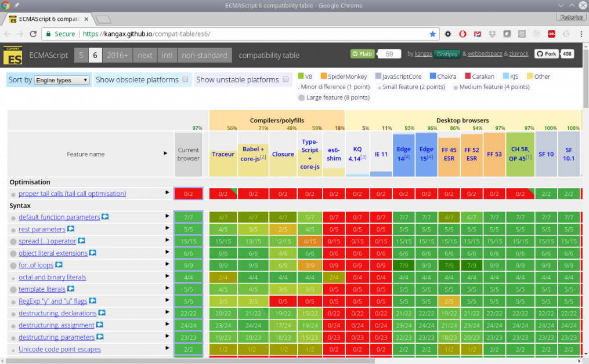
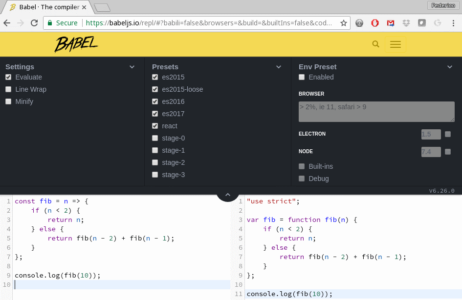
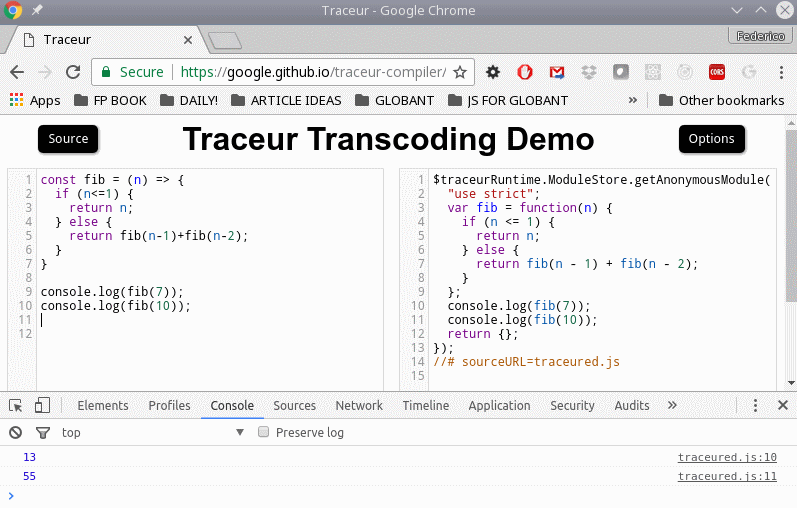
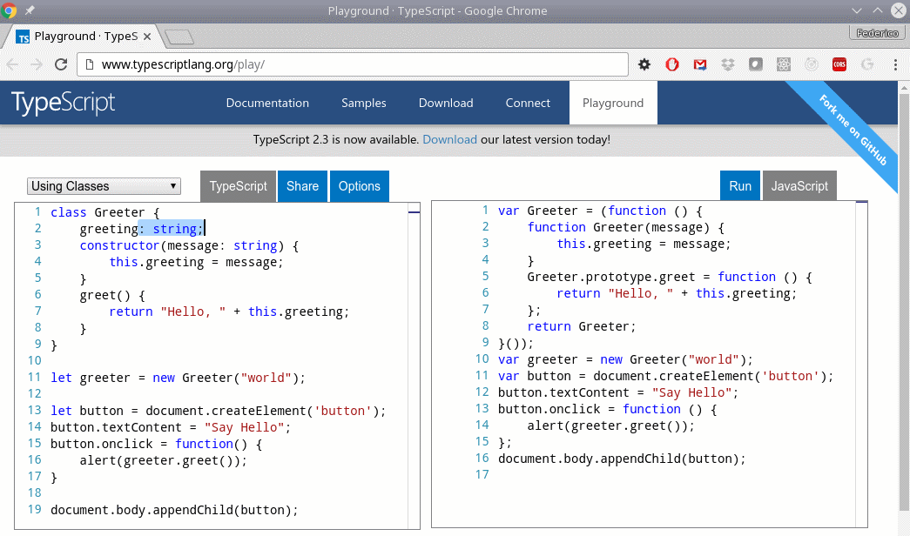
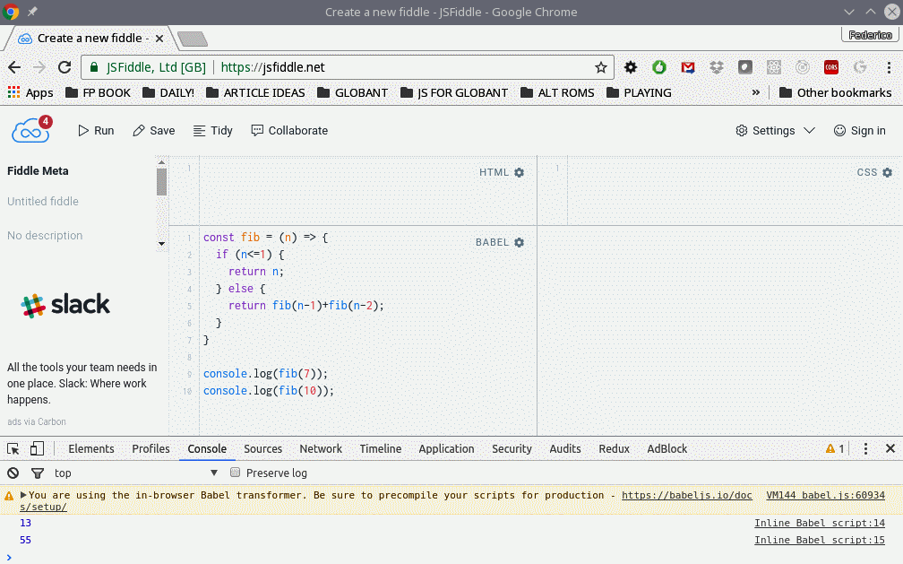

# Becoming Functional - Several Questions

# 第一章 函数式编程起步——若干问题 


函数式编程（或 `FP`）早在计算机时代初期就已经诞生了。由于它越来越多地应用于多个框架和工具库，尤其是 `JavaScript`（`JS`） 相关领域，函数式编程正经历着某种意义上的复兴。本章主要内容有：

1. 介绍函数式编程的相关概念，对其有个初步认识；
2. 使用函数式编程带来的好处（及问题），以及为什么要使用它；
3. 考察 `JavaScript` 适合进行函数式编程的原因；
4. 回顾必要的 `JS` 特性与常用工具，以全面掌握本书各知识点。

学完本章，您将习得本书后续章节会用到的基本工具。首先来了解一下函数式编程。


## 1. 何谓函数式编程？What is functional programming?

回顾一下计算机发展史，您会发现仍在使用的第二古老的编程语言 `Lisp`，就是以函数式编程为基础的。此后，函数式语言层出不穷，函数式编程的应用也更加广泛。但即便如此，如果问大家什么是函数式编程，您可能会得到两种截然不同的回答。

> 小知识
>
> 对于喜欢打破砂锅问到底的人或爱好历史掌故的发烧友而言，目前仍在使用的最古老的语言是 `Fortran`，它出现于 1957 年，比 `Lisp` 早一年。 在 `Lisp` 之后不久，出现了另一种长期存在的语言 `COBOL`，用于面向业务的编程。

取决于询问的人，您要么听到这样的回答：函数式编程是一种现代的、先进的、开明的编程手法，其他编程范式在它面前都会黯然失色；要么听到另一种声音：函数式编程基本上还是一个理论的产物，其复杂程度超过了带来的好处，在现实世界中几乎不可能实现。实际上，真正的答案，同往常一样，并不是非黑即白地走极端，而是介于这两者之间。我们不妨从理论与实践的对比出发，看看应该如何使用函数式编程。


### 1.1. 对比理论与实践 Theory versus practice

本书不会对函数式编程作理论上的深入探讨，而是重点展示如何将函数式编程的一些技术和原则成功应用于日常的 `JavaScript` 编程中。本书也不会教条式地行文，而是从实用的角度展开各个话题。我们既不会因为某些有用的 `JavaScript` 构造（constructs）不符合函数式编程的学术要求而绕开它们，也不会仅仅为了迎合函数式的编程范式而避开一些实用的 `JavaScript` 特性。事实上，本书毋宁说是在介绍 **类函数式编程**（`SFP`, **S**orta **F**unctional **P**rogramming），因为书中的代码其实是这三者的有机结合：**函数式编程特性**、经典的 **命令式编程风格**、以及 **面向对象编程（object-oriented programming, 即 OOP）** 的编程范式。

即便如此，本书也并非将所有的理论知识都搁置一旁。书中会有侧重地论述函数式编程的主要观点，介绍一些相关术语和基本定义，并对函数式编程的核心概念作重点阐释。我们将始终秉持“能写出务实高效的 `JavaScript` 代码”的初衷，不会一味去追求那些晦涩难懂的、古板教条式的函数式写法。

在编写大型程序和系统、以及开发清爽且可扩展的应用程序架构时，面向对象编程已经成为应对其固有复杂度的一种解决方案；一方面，随着当今 `Web` 应用程序的持续扩展，所有项目代码的复杂度都在不断增加；另一方面，`JavaScript` 的新特性甚至使得几年前几乎不可能实现的应用程序开发成为了可能：例如使用 `Ionic`、`Apache Cordova` 或 `React Native` 制作的移动端（混合端）应用程序，或使用 `Electron` 或 `NW.js` 制作的桌面应用程序。时至今日，`JavaScript` 已经通过 `Node.js` 试水后端开发，该语言的使用范围正以一种严肃认真的方式不断扩大，以应对现代设计带来的复杂性。


### 1.2. 换一种方式思考 A different way of thinking

函数式编程是另一种编程方式，学起来可能还会比较吃力。在大多数语言中，编程往往是以命令式的方式进行的。程序是一系列以规定方式执行的语句，通过创建对象并操作它们来实现预期的结果，这通常意味着修改对象本身。而函数式编程则是基于特定的表达式求值来得到想要的结果。这些表达式由组合在一起的 **函数** 构建而成。在函数式编程中，常见的操作有函数传递（pass functions around，将函数作为另一个函数的参数传入，或者将一个函数作为原函数的计算结果返回）、不使用循环（not use loops，替之以递归）、以及跳过副作用（skip side effects，修改对象或全局变量本身）等等。

换言之，函数式编程聚焦的是该实现什么，而非怎样实现。您无需担心循环和数组的问题，而是在更高层面上考虑需要完成的任务。一旦习惯了这种风格，您的代码将变得更简洁优雅，并且可以轻松付诸测试及调试。但是，也不要落入以函数式编程为终极目标的陷阱！与其他软件工具一样，函数式编程仅仅是解决问题的一种手段而已。有时候函数式风格的代码未必就是好代码。正如任何技术一样，用函数式编程的思想写出糟糕的代码也是极有可能的！


### 1.3. 函数式编程不是什么？What FP is not

前面介绍了函数式编程 **是什么**，这里有必要澄清一些常见的误区，看看函数式编程 **不是什么**——

- **函数式编程不是形而上学的产物**：诚然，由 *Alonzo Church* 于 1936 年提出的 **lambda 算子** 确实是证明理论计算机科学（比现代计算机语言的出现早 20 多年）重要成果的工具，函数式编程也以此为基础；然而如今的函数式编程语言已经在各种系统比比皆是；
- **函数式编程不是面向对象编程的反面**：声明式与命令式风格不必非得二选一，也可以根据喜好进行混搭，就像本书中即将论述的那样，将所有的最佳实践结合到一起；
- **函数式编程学起来并不复杂**：一些函数式编程语言与 `JavaScript` 有很大不同，但差异主要体现在语法层面。一旦了解基本概念，您就会发现在 `JavaScript` 中也能殊途同归地得到相同的结果。


## 2. 为何使用函数式编程？Why use FP?

多年来，众多编程风格与潮流层出不穷。然而，函数式编程强大的适应性已经得到公认，并且在今天引起了广泛关注。我们为什么要使用函数式编程？或者换个问法，首先是：您想得到什么？其次是：函数式编程能满足这样的要求吗？后续章节将回答这些重要的问题。

### 2.1. 我们要的是什么

我们应该认同以下观点是普遍存在的。代码应该具有以下特征——

- **模块化**：程序功能应该被切分成独立的模块，各个模块负责相应某方面的功能。模块或功能的变动不应该影响其余模块代码；
- **易理解**：阅读代码的人要能毫不费力地辨别出组件、对应的功能及其相互关系。这与代码的可维护性息息相关。您的代码可能会在今后的某个节点进行维护，无论是直接修改还是添加新功能；
- **可测试（单元测试）**：在模块上进行单元测试，验证其功能不依赖于其他模块。所采用的编程风格应该有助于简化单元测试。单元测试也应该像文档那样设计，以便阅读代码的人理解这段代码实现的功能；
- **可扩展**：事实上，程序总会需要维护的，比如添加新功能。这些改动对原来的数据结构和数据流造成的影响（如果有的话）应该尽可能小。小改动不应引发代码的大规模重构；
- **可重用**：代码重用旨在节省资源、时间、财力，通过利用之前写过的代码减少重复劳动。一些特性有助于实现这一目标，比如上面提到的 **模块化**，以及 **高内聚**（模块的所有部分都在一起），**低耦合**（模块间相互独立），**焦点分离**（程序在功能层面要尽可能少的出现重叠）以及 **信息隐藏**（模块内部的更改不应影响系统的其余部分）

### 2.2. 我们能学到什么

那么，函数式编程能否满足上面提到的五个要求呢？

- 函数式编程的目标，是分别编写相互独立的函数，再将这些函数联系到一起得出最终结果；
- 采用函数式风格编写的程序通常更简洁有力、更易于理解；
- 函数本身就是可测试的，函数式编程产出的代码在这方面具有天然优势；
- 由于相互独立，在不依赖系统其他部分的情况下，其他程序中的函数可被直接重用。大多数函数式程序共享通用函数，本书将从中挑选一些进行论述。
- 函数式的代码没有副作用（`side effects`），这意味着研究一个函数要实现的最终目的时无需考虑程序的其他部分。

最后，一旦习惯了函数式编程的风格，代码将变得更易于理解与扩展。因此函数式编程看起来完全可以实现上面提到的五个特征。

> **小知识**
>
> 为了全面了解使用函数式编程的原因，建议阅读 **John Hughes** 撰写的 ***Why Functional Programming Matters***； 详见在线资源 www.cs.kent.ac.uk/people/staff/dat/miranda/whyfp90.pdf。 虽然不是面向 `JavaScript` 讲的，但相关参数很容易理解。


### 2.3. 函数式编程并非万能钥匙

但是辩证来看的话，函数式编程并不是万能钥匙，可以自动将代码变得更好。一些函数式的解决方案实际上很棘手。某些开发人员非常喜欢编写代码，然后提问：这一段是干啥的？稍不留神，代码就可能“仅仅只是写出来了”，根本无法维护，更别提易于理解、便于扩展或者可重用什么的了。

函数式编程的另一个不足在于，精通此道的开发人员寥寥无几（你见过多少为函数式编程风格的程序员量身打造的招聘信息？）。当前绝大多数的网络代码都是命令式的、非函数式的，而且绝大多数程序员也都习惯了这种工作方式。对于某些人来说，强制换用新轮子、以另一种风格来编程可能是一个无法逾越的障碍。

最后，如果想在 `JavaScript` 中完全运用函数式编程思想，可能会举步维艰，原来简单的任务很可能难以完成。正如前面提到过的，本书将采用类函数式（`sorta FP`）的方式，因此不会摒弃纯函数式编程以外的语言特性。毕竟，我们想用函数式编程来简化编码，而不是简单的事情复杂化！

因此，尽管笔者会努力演示函数式编程在代码实现过程中的诸多优势，但与任何更改一样，总会遇到一些困难。但我完全相信读者能够克服它们；也坚信您的组织在实践函数式编程后会开发出更好的代码。勇于改变吧！假设采用函数式风格编程适用于你当下的应用场景，接下来要考虑另一个问题是：将函数式编程风格引入 `JavaScript` 真的合适吗？


## 3. JavaScript 是函数式编程语言吗？Is JavaScript functional?

差不多是时候弄明白另一个重要问题了：`JavaScript` 是函数式语言吗？通常，`JavaScript` 都不会出现在函数式编程语音的清单里。列入清单的都是些不怎么常见的语言，例如 `Clojure`、`Erlang`、`Haskell` 和 `Scala`；但函数式编程语言并没有一个准确的定义，也没有该语言所特有的功能特性的精确描述。最主要的是，如果一种语言支持与函数式编程相关的通用编程风格，就可以认为是函数式编程语言。让我们首先来了解一下为什么要使用 `JavaScript`，看看该语言是如何发展到其当前版本的，然后再来了解用 JavaScript 进行函数式编程的一些关键特性。


### 3.1. 作为一种工具

`JavaScript` 是什么样的语言呢？就流行指数而言，正如在 www.tiobe.com/tiobe-index/ 或 http://pypl.github.io/PYPL.html 上看到的一样，`JavaScript` 一直是最受欢迎的十大语言之一。从更偏学术的角度来看，`JavaScript` 更像一个从多种不同语言借用了相关特性所构成的综合体。一些库通过提供不太容易获得的特性来帮助该语言发展，例如类（`class`）和继承（`inheritance`）（目前的版本的确支持类，不久前情况并非如此），否则必须从 **原型** 上取巧实现。

> **小知识**
>
> 当年选择 `JavaScript` 这个名字是为了蹭 `Java` 语言的热度——出于营销的目的。其最早的名字叫 `Mocha`，然后又叫 `LiveScript`，最后才叫 `JavaScript`

现如今 `JavaScript` 已经变得非常强大了。但是与所有强大的工具一样，在提供出色的解决方案的同时，也可能带来巨大的危害。函数式编程或许能够减少或避开该语言中一些最糟糕的部分，以一种更安全、更好的方式工作；然而，由于现有的 `JavaScript` 代码量巨大，要是指望它来推动 `JavaScript` 代码 —— 这种可能导致绝大多数网站失效的语言 —— 进行大规模重构，最终也是痴人说梦。无论好坏都得去学习了解，然后再扬长避短。

此外，`JavaScript` 还拥有大量现成的第三方库，以多种方式丰富并拓展了该语言的适用范围。本书将围绕 `JavaScript` 本身，引用现成代码进行论述讲解。

至于 `JavaScript` 是否是实际意义上的函数式编程语言，答案仍旧是：可能是。因为 `JavaScript` 具备的几个特性，例如一等公民函数、匿名函数、递归和闭包（稍后会有论述），让其可被视为函数式编程语言；但另一方面，它也有一些非函数式风格的特点，例如副作用（不纯性（`impurity`））、可变对象和受限的递归。因此，采用函数式方式编程时，既要利用好 `JavaScript` 所有相关的、恰当的语言特性，也要尽量减少由语言本身引入的问题。从这个意义上说，`JavaScript` 是不是函数式的语言，取决于所采用的编程风格。

要使用函数式编程，应该决定选用哪种语言；然而，一味选择纯函数式语言未必就是明智之举。如今写代码并不仅仅是使用一种编程语言那么简单，还得有框架、库和其他各种工具的支撑。如果能在利用好现有工具的同时，在代码中恰当地引入函数式的编程风格，这样双管齐下，`JavaScript` 是否是函数式编程语言，已经不重要了。


### 3.2. 用 `JavaScript` 实现函数式编程

`JavaScript` 一直在与时俱进。本书将采用的版本叫作 `JS10`（非正式），或者 `ECMAScript 2019`（正式），通常缩写为 `ES2019` 或 `ES10`；该版本于 2019 年 6 月发布，早起主要版本沿革如下：

- `ECMAScript 1`，1997 年 6 月
- `ECMAScript 2`，1998 年 6 月，基本和上一版相同
- `ECMAScript 3`，1999 年 12 月，加入一些新功能
- `ECMAScript 5`，2009 年 12 月（没有 `ECMAScript 4`，被废弃了）
- `ECMAScript 5.1`，2011 年 6 月
- `ECMAScript 6`（或 `ES6`，后更名为 `ES2015`）2015 年 6 月
- `ECMAScript 7` （亦即 `ES7`，或 `ES2016`）2016 年 6 月
- `ECMAScript 8` （`ES8` 或 `ES2017`）2017 年 6 月
- `ECMAScript 9`（`ES9` 或 `ES2018`），2018 年 6 月


> **小知识**
>
> `ECMA` 最初表示欧洲计算机制造协会（European Computer Manufacturers Association），现如今已不仅仅被视为首字母缩写了。该组织还负责除 `JavaScript` 外的其他标准化工作，例如 `JSON`、`C#`、`Dart` 等等。详见 www.ecma-international.org/

您可以在 www.ecma-international.org/ecma-262/7.0/](http://www.ecma-international.org/ecma-262/7.0/) 查看语言标准规范。没有明确规定的情况下，本书中的 `JavaScript` 皆为 `ES10`（`ES2019`）版。至于书中涉及的语言特性，如果用的是 `ES2015`，基本上也不会有什么问题。

目前还没有浏览器完全实现 `ES10` 标准；大多数都提供旧版的 `JavaScript 5`（始于 2009 年），并夹带一些不断增长地、从 `ES6` 到 `ES10` 的少量新特性。这会带来一个问题，所幸是可以解决的问题，后文会有论述；本书将使用 `ES10`。


> **小知识**
>
> 事实上 `ES2016` 与 `ES2015` 之间的差别很小，比如方法 `Array.prototype.includes`，以及取幂运算符 `**`。而 ES2017 与 ES2016 的差别较大——像 `async` 与 `await` 语法、字符串填充函数等等——但均不影响我们的代码。在后续章节中，本书将对甚至是最近新增的功能，`flatMap`，给出相应的替代方案。


正式使用 JavaScript 前，先来考察一下与函数式编程目标相关的最重要的几个语言特性。


### 3.3. 关键语言特性

`JavaScript` 并非纯粹的函数式编程语言，但也具备一旦视为函数式编程语言所应该具备的全部语言特性。本书将用到的主要特性如下：

- 函数作一等公民对象
- 递归
- 箭头函数
- 闭包
- 展开运算符

接下来，就每个特性给出示例，考察它们有所助益的原因。同时也要注意，`JavaScript` 的特性远比我们即将用到的要多。下面介绍的内容旨在突出函数式编程最重要的语言特性。


#### 3.3.1 函数作一等对象

函数作一等对象（也叫一级公民），表示可以像处理其他对象那样处理函数。例如，将函数存入一个变量、将其传给另一个函数，打印出来等等。这也是函数式编程的关键所在：将函数作为参数传给其他函数，或是将返回一个函数作为某函数调用的结果。

如果运行的是异步 `Ajax`，那么您已经使用过这个特性了：回调函数（`callback`）是一个 `Ajax` 调用执行完毕时触发执行的函数。该函数以参数形式传入。利用 `jQuery`，可以写出像下方那样的代码：

```javascript
$.get("some/url", someData, function(result, status) {
    // 检查 status 状态，
    // 并用 result 完成相关逻辑
});
```

`$.get()` 函数接收一个回调函数作参数，并在获取到结果（`result`）时调用该函数。


> **小贴士**
>
> 回调函数的问题，在更现代的解决方案中，通过使用 `promise` 或 `async/await` 语法可以得到更好的处理。鉴于仅供演示，走老路也无伤大雅。本书将在第 12 章“构建更好的容器——函数式数据类型”论述 `monad` 相关概念时，重新讨论 `promise` 的问题，详见 “Unexpected `Monads` - `Promises`” 相关章节。

鉴于函数可以存到变量中，上述代码也可以改写如下。注意 `$.get(...)` 调用中变量 `doSomething` 的使用：

```js
var doSomething = function(result, status) {
    // 检查 status 状态，
    // 并用 result 完成相关逻辑
};

$.get("some/url", someData, doSomething);
```

更多示例将在第 6 章产出函数 - 高阶函数中论述。


#### 3.3.2  递归

**递归** 是开发算法的最为行之有效的工具，也是解决大类问题的有力助手。其核心理念是函数可以在某个时刻调用自身，当 *那一次* 调用完成后，将得到的结果再作进一步处理。 该方法通常对某些特定问题或定义很有帮助。最经典的示例是定义非负整数 `n` 的阶乘函数（*`n`* 的阶乘写作 *`n!`*）：

> - 若 *`n`* 为 0，则 *`n!`* = 1；
> - 若 *`n`* 大于 0，则 *`n! = n * (n-1)!`*


> **小贴士**
>
> *`n!`* 值是对 *`n`* 个不同元素进行全排列的所有可能的排序方式的描述。例如将五本书排成一排，任选其一放入第一个位置，然后对剩余四本作全排列，则 *`5! = 5 * 4!`*。以此类推，将得到 *`5! = 5 * 4 * 3 * 2 * 1 = 120`*，因此 *`n!`* 是 1 到 *`n`* 的所有整数的乘积。

这可以快速转成代码描述：

```js
function fact(n) {
    if (n === 0) {
        return 1;
    } else {
        return n * fact(n - 1);
    }
}

console.log(fact(5)); // 120
```

递归对算法设计大有帮助。递归可以等效替换所有 `while` 或 `for` 循环——并非刻意为之，关键是提供了一种可能性！本书将在 *第 9 章 设计函数 - 递归* 中全面论述以递归方式设计算法和编写函数的相关知识。


#### 3.3.3 闭包

闭包是隐藏数据的一种方式（结合私有变量），由此引入模块及其他不错的语言特性。闭包的关键在于，定义函数时，既可以引用自身的局部变量，也可以引用函数上下文以外的所有内容。利用闭包可以创建一个统计自身运行次数的计数函数：

```js
function newCounter() {
    let count = 0;
    return function() {
        count++;
        return count;
    };
}

const nc = newCounter();
console.log(nc()); // 1
console.log(nc()); // 2
console.log(nc()); // 3
```

即使 `newCount()` 退出执行，其内部函数仍可以访问 `count`，但对任何其余代码而言该变量却无法访问。

这是函数式编程的一个绝佳示例。函数（本例为 `nc()`）在参数相同的情况下不会返回其他截然不同的结果。

本书将考察闭包的几个实际应用，例如 `memoization`（记忆功能）（详见 *第四章 正确的行为 - 纯函数*、*第六章 产出函数 - 高阶函数*），以及 **模块模式** （`module pattern`）（详见 *第三章 从函数入手 - 核心概念*、*第十一章 实践设计模式 - 以函数式的风格*）。


#### 3.3.4. 箭头函数

箭头函数是一种更简短、更简洁创建（具名或匿名）函数的方法。除了不能用作构造函数外，箭头函数几乎可以在任何地方与传统函数互换。其语法如下：

- `(parameter, anotherparameter, ...etc) => { statements }`
- `(parameter, anotherparameter, ...etc) => expression`

前者可以编写任意数量的代码，后者是 `{ statements }` 的缩写。重写之前的 `Ajax` 示例如下：

```js
$.get("some/url", data, (result, status) => {
    // 检查 status 状态，
    // 并用 result 完成相关逻辑
});
```

箭头函数版阶乘函数可以改写如下：

```js
const fact2 = n => {
    if (n === 0) {
        return 1;
    } else {
        return n * fact2(n - 1);
    }
};
console.log(fact2(5)); // also 120
```

> **小贴士**
>
> 箭头函数通常被称作匿名函数（`anonymous function`），因为它们没有名字。若要引用一个箭头函数，须将其赋给一个变量或对象属性，如上例所示；否则无法使用。本书将在 *第三章 从函数入手 - 核心概念* 的箭头函数小节作进一步探讨。

新版阶乘函数也可以写为单行代码——您能看出与之前的代码是等效吗？采用三目运算符来代替 `if` 语句是很常见的做法：

```js
const fact3 = n => (n === 0 ? 1 : n * fact3(n - 1));

console.log(fact3(5)); // again 120
```

有了这样的简写形式，保留字 `return` 也可以省略不写了。

> 在 `lambda` 演算中，诸如 `x => 2x` 之类的函数可以表示为 `λx.2x`。尽管存在语法差异，但定义是类似的。多参函数的表示稍微复杂一点：`(x, y) => x + y` 表示为 `λx.λy.x+y`。本书将在第三章的 *Lambda and functions* 小节、以及第七章的 *Currying* 小节作进一步介绍。

还有一点要记住：箭头函数在只有一个参数时，该参数两旁的括号可以省略不写。笔者更倾向于保留括号，但书中代码已经过 `JS` 美化工具 `Prettier` 处理，从而删除了括号；是否保留括号完全取决于个人喜好（详见 https://github.com/prettier/prettier）。顺便说一下，笔者使用的格式化配置参数是 `--print-width 75 --tab-width 2 --no-bracket-spacing`。


#### 3.3.5 展开运算符

[展开运算符](https://developer.mozilla.org/en/docs/Web/JavaScript/Reference/Operators/Spread_operator) 可以将一个表达式扩展到需要传入多个参数、元素或变量的地方。例如替换函数的参数：

```js
const x =  [1, 2, 3];

function sum3(a, b, c) {
    return a + b + c;
}

const y = sum3(...x); // equivalent to sum3(1,2,3)
console.log(y); // 6
```

也可以创建或连结数组如下：

```js
const f = [1, 2, 3];

const g = [4, ...f, 5]; // [4,1,2,3,5]

const h = [...f, ...g]; // [1,2,3,4,1,2,3,5]
```

展开运算符也可以作用于对象：

```js
const p = { some: 3, data: 5 };

const q = { more: 8, ...p }; // { more:8, some:3, data:5 }
```

还可用于需要传入多个参数而非数组的函数中，常见的例子是 `Math.min()` 与 `Math.max()`：

```js
const numbers = [2, 2, 9, 6, 0, 1, 2, 4, 5, 6];
const minA = Math.min(...numbers); // 0

const maxArray = arr => Math.max(...arr);
const maxA = maxArray(numbers); // 9
```

利用 `.apply()` 方法接收一个 **参数数组**、`.call()` 方法接收 **独立的参数** 的特性，也可以得到下面的恒等式：

```js
someFn.apply(thisArg, someArray) === someFn.call(thisArg, ...someArray);
```

> **小知识**
>
> 如果在记住 `.apply()` 与 `.call()` 各自所接收的参数问题上犯难，这个顺口溜或可助您一臂之力：***A is for an array, and C is for a comma***（A 对应 `Array` 数组，C 对应逗号），详见 https://developer.mozilla.org/en-US/docs/Web/JavaScript/Reference/Global_Objects/Function/apply 及 https://developer.mozilla.org/en-US/docs/Web/JavaScript/Reference/Global_Objects/Function/call。

利用展开运算符可以写出更简短、简洁的代码。

至此，我们回顾了即将用到的所有重要语言特性。作为本章的结尾，再来看看即将用到的一些工具。


## 4. 怎样使用 `JavaScript`？How do we work with JavaScript?

上面介绍的语言特性都很不错，但正如前文提到的那样，适用性最广的 `JavaScript` 的版本，往往并不是最新的 `ES13`，而更有可能是早期的 `JS5`。这当中 `Node.js` 算个例外。它基于 `Chrome` 浏览器的 `V8` 高性能 `JavaScript` 引擎。该引擎已经实现了多项 `ES13` 特性。尽管如此，截至目前（2023 年 5 月），`V8` 引擎对 `ES13` 特性的覆盖率仍达不到 100%，总会有一些特性缺失（更多 `Node.js` 和 `V8` 信息，详见 [https://nodejs.org/en/learn/getting-started/ecmascript-2015-es6-and-beyond](https://nodejs.org/en/learn/getting-started/ecmascript-2015-es6-and-beyond)）。这种情况今后肯定会改变，因为 `Internet Explorer` 浏览器将逐渐淡出人们的视野（对它的支持已于 2022 年 6 月正式结束），取而代之的，是共享 `Chrome` 引擎的 `Microsoft Edge` 浏览器。无论如何，就目前而言，我们仍须同旧的、效率较低的 `JS` 引擎打交道。

怎样在当前可用的早期版本中尝鲜新的语言特性呢？或者，如果您的大多数用户使用的是旧版浏览器，不支持您推崇备至的那些花哨的特性，该如何是好？让我们来看看一些现成的解决方案。

若要在尝试任何特定的新特性之前进行选择，可以查看 [https://compat-table.github.io/compat-table/es6/](https://compat-table.github.io/compat-table/es6/) 上的兼容性列表（如 *图1.1* 所示）；查看 `Node.js` 规范，详见 [http://node.green/](http://node.green/)。



图 1.1. - JavaScript 的最新特性可能无法全面支持，使用前需要检查一下


### 4.1. 使用转译工具 Using transpilers

为了解决可用性和兼容性的问题，可以使用一些 **转译工具**（`transpilers`）。转译器将您的原始 `ES10` 代码（可能涉及最新的 `JavaScript` 特性）转换为等效的 `JS5` 代码。这是一个从源码到源码（`source-to-source`）的转换，而不是编译过程使用的源码到对象（`source-to-object`）的方式。编码时可以用高级 `ES10` 特性，而用户的浏览器接收的是 `JS5` 代码。尽管浏览器在桌面端和移动端采用新标准尚需时日，转译器可以让您同步到即将发布的语言版本。

关于 `transpiler` 一词的来历，它是 *`translate`* 和 *`compiler`* 的结合体。类似的组合在技术领域屡见不鲜：电邮 `email`（*`electronic`* 与 *`mail`* 的组合）、表情符号 `emoticon`（*`emotion`* 和 *`icon`* 的组合）、恶意软件 `malware`（*`malicious`* 与 *`software`* 的组合）以及字母数字 `alphanumeric`（*`alphabetic`* 与 *`numeric`* 的组合）……不一而足。

最常见的 `JavaScript` 转译器是 `Babel`（详见 https://babeljs.io/）和 `Traceur`（详见 https://github.com/google/traceur-compiler）。结合 `npm` 或 `webpack` 等工具，相关配置十分轻松，可将代码自动转译成终端用户需要的版本。您也可以在线转译，如 *图 1.2* 所示的 Babel 在线转译环境示例：



图 1.2 - `Babel` 在线转译器将 `ES10` 代码转译为兼容的等效 `JS5` 代码示意图

如果喜欢 `Traceur`，可以在 https://google.github.io/traceur-compiler/demo/repl.html# 进行尝试，不过需要在开发者控制台查看转译后的代码结果（*图 1.3* 为转译后的代码示例）。选中 `EXPERIMENTAL` 选项来启用 `ES10` 特性：



图 1.3 - `Traceur` 转译工具是 ES10 转 JS5 的另一种行之有效的替代方案。

> **小贴士**
>
> 了解转译工具也是学习新语言特性的绝佳途径。在左边敲入代码即可在右边得到等效的转译代码。此外，还可以使用命令行工具来转译源代码，对比查看输出的结果。

最后还有一种方案：选用 `Microsoft` 的 `TypeScript`（http://www.typescriptlang.org/），而不是 `JavaScript`。它是 `JavaScript` 的超集，可以被编译为 `JS5` 的代码。`TypeScript` 的主要优点是能够向 `JavaScript` 选择性地添加静态类型检查，这有助于在编译时检测某些代码问题。注意：与 `Babel` 或 `Traceur` 一样，并非所有 `ES10` 语言特性都支持。

> 除了 `TypeScript`，还可以使用 `Facebook` 的 `Flow` 进行类型检查（详见 https://flow.org）。

若选用 `TypeScript`，可以利用其 `playground` 训练场模块进行线上功能测试（详见 http://www.typescriptlang.org/play/）。`TypeScript` 可以对类型检查的严格程度进行配置，也可以实时运行代码，如 *图 1.4* 所示：



图 1.4 - TypeScript 新增的类型检查特性有助于更安全地编写代码

通过使用 `TypeScript`，可以规避掉一些常见的类型方面的错误。当下有个积极的趋势，是大多数工具（框架、库等）正在慢慢朝这个方向发展，从而使今后的编码工作越来越轻松。


### 4.2. 应用在线环境 Working online

网上有不少工具可以用来测试 `JavaScript` 代码，比如 `JSFiddle`（https://jsfiddle.net/）、`CodePen`（https://jsbin.com/）等等。您需要设定是否使用 Babel 或 Traceur，否则新语言特性将不生效。如 *图 1.5* 中的 `JSFiddle` 示例：



图 1.5 - `JSFiddle` 可以在无需引入其他工具的情况下试验新的 `JavaScript` 特性（带 HTML 及 CSS）

这些工具的应用为我们快速尝试新特性、试验新功能提供了新的途径——这一点我可以保证，因为本书大部分代码就是采用这种方式进行测试的结果！


### 4.3. 测试环境 Testing

本书也会涉及测试方面的知识，毕竟易于测试是函数式编程的主要优点。本书之前的版本用的测试框架为 `Jasmine` （[https://jasmine.github.io/](https://jasmine.github.io/)），这一版改用 Facebook 的 `Jest`（[jestjs.io/](https://jestjs.io/)）框架——一款基于 `Jasmine` 构建的新测试框架。

`Jest` 以其卓越的易用性与广泛的适用性而持续受到热捧：无论是前端应用还是后端代码，几乎不需要什么配置就能进行同等效果的测试（更多安装配置详情，可参阅 [jestjs.io/docs/getting-started](https://jestjs.io/docs/getting-started)）。本书不会对每一段代码编写测试用例，但遵循 **测试驱动开发（test-driven development, 即 TDD）** 的观点，大多数情况还是会考虑的。


## 5. 小结 Summary

本章介绍了函数式编程的基础知识点、相关发展历史、优缺点等，考察了在 `JavaScript` 中应用函数式编程的可能性（尽管 `JavaScript` 不是正统的纯函数式编程语言），以及本书后续将会用到的一些工具。

在 *第二章 从函数式的角度考虑问题 - 第一个示例* 中，我们将从一个简单问题切入主题，先从普通方式进行考察，再用函数式编程的角度提出新的解决方案，最后分析讨论这样做的好处。


## 6. 习题 Questions

1.1. **将类作为一级对象**：我们知道函数在 `JavaScript` 中是一等公民，那您是否知道类（`classes`）同样也是吗？（尽管将类说成对象有点不伦不类）看看下面的例子为什么可以这么说吧。留心其中有一些代码是刻意混淆视听的：

```js
const makeSaluteClass = term => 
	class {
        constructor(x) {
            this.x = x;
        }
        
        salute(y) {
            console.log(`${this.x} says "${term}" to ${y}`)
        }
    };

const Spanish = makeSaluteClass("HOLA");
new Spanish("ALFA").salute("BETA");
// ALFA says "HOLA" to BETA

new (makeSaluteClass("HELLO"))("GAMMA").salute("DELTA");
// GAMMA says "HELLO" to DELTA

const fullSalute = (c, x, y) => new c(x).salute(y);
const French = makeSaluteClass("BON JOUR");
fullSalute(French, "EPSILON", "ZETA");
// EPSILON says "BON JOUR" to ZETA
```


1.2. **阶乘的校验**：我们定义的阶乘函数仅对非负整数有效；但在讲递归时重写的阶乘版本中，并未对参数验有效性进行验证。您能加上必要的验证逻辑吗？尽量避免重复、冗余的测试。


1.3. **递增版阶乘**：我们定义的阶乘函数，先是乘以 *n*，再乘以 *n-1*、*n-2* …… 依此类推，我们称其为递减的方式；您能写一个递增版的阶乘函数吗？


1.4. **代码压缩**：代码压缩本身并不算一个目标，但通过使用箭头函数和一些其他 `JavaScript` 特性，是可以将计数函数 `newCounter()` 压缩到原长度的一半的。您看出来了么？


---


---


---


---

> **参考答案**


1.1. 回想一下，类基本上算一个可以与保留字 `new` 一起使用的函数。因此，将类作为参数传给其他函数是理所当然的。`makeSaluteClass()` 创建了一个类（即一个特殊的函数）。它使用一个闭包来存储 `term` 的值。本书在后续章节会给出更多类似的例子。


1.2. 避免重复测试的关键，是编写一个函数来检查参数的值以确保它是有效的。可以通过调用一个内部函数来执行阶乘本身的逻辑，而不必担心参数错误：

```js
const carefulFact = n => {
    if (
        typeof n !== "undefined" &&
        Number(n) === n &&
        n >= 0 &&
        n === Math.floor(n)
    ) {
        const innerFact = n => (n === 0 ? 1 : n * innerFact(n - 1));
        return innerFact(n);
    }
};

console.log(carefulFact(3)); // 6, correct
console.log(carefulFact(3.1)); // undefined
console.log(carefulFact(-3)); // undefined
console.log(carefulFact(-3.1)); // undefined
console.log(carefulFact("3")); // undefined
console.log(carefulFact(false)); // undefined
console.log(carefulFact([])); // undefined
console.log(carefulFact({})); // undefined
```

您也可以在参数不正确时抛一个 `error` 错误，此处省略了这一步直接返回 `undefined`。


1.3. 满足题目要求的代码实现如下：通过引入一个辅助变量 `f`，使其从 `1` 递增到 `n`。要特别小心 `factUp(0) === 1` 的情况：

```js
const factUp = (n, f = 1) => (n <= f ? f : f * factUp(n, f + 1));
```


1.4. 根据提示，使用箭头函数，结合前置的累加运算符 `++` 的使用（详见 https://developer.mozilla.org/en-US/docs/Web/JavaScript/Reference/Operators/Arithmetic_Operators#Increment），可以得到如下代码：

```js
const shorterCounter = () => {
    let count = 0;
    return () => ++count;
};
```

虽然箭头函数不难理解，但要注意，不少开发者可能对前置的累加运算符 `++` 的使用存疑，因此这样的改写反而更不便于理解。


