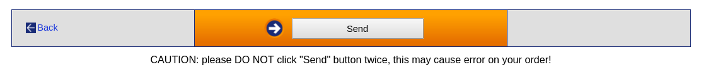
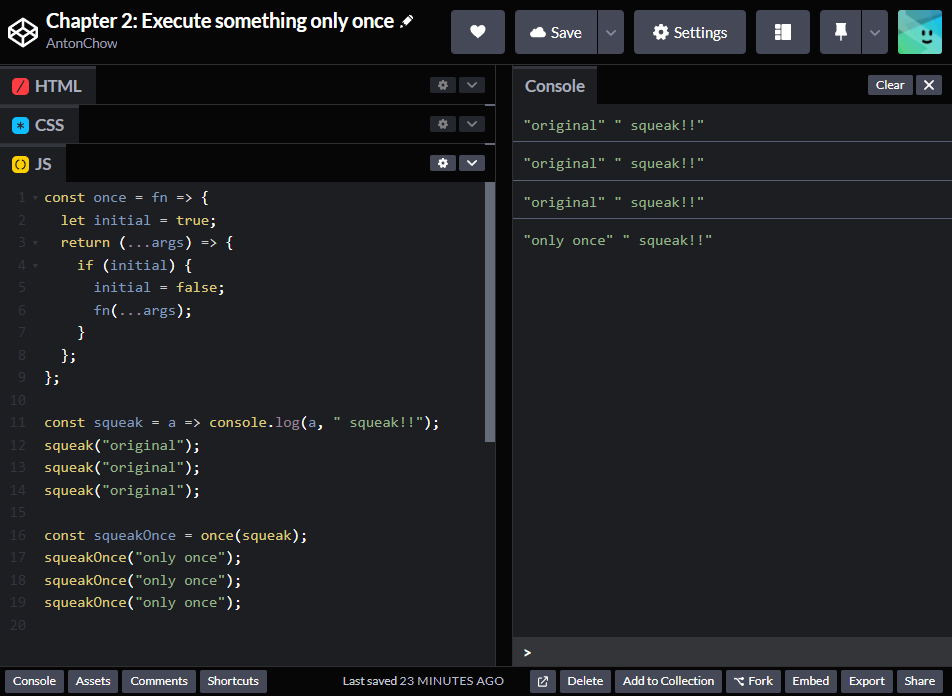
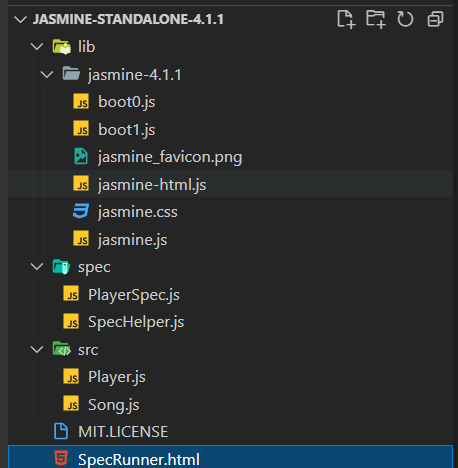
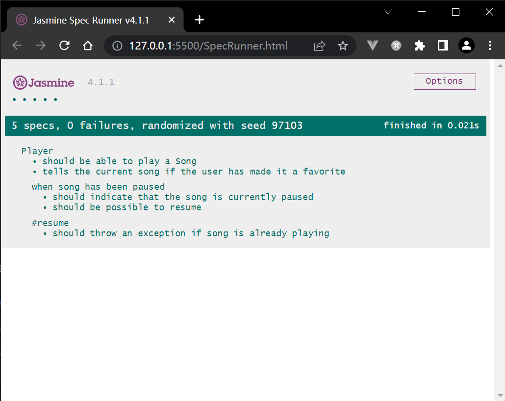
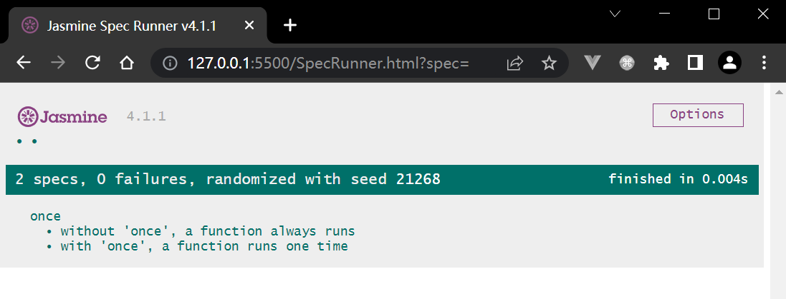
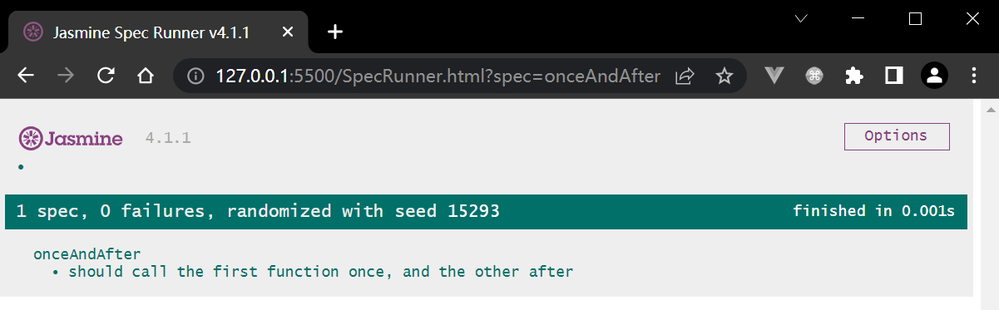

# Thinking Functionally - A First Example

# 第二章 函数式地思考问题——第一个案例


第一章我们回顾了函数式编程是什么、论述了应用函数式编程的一些优点、并介绍了使用 `JavaScript` 过程中需要的一些工具。现在让我们抛开理论，从一个简单的问题入手，看看怎样用函数式编程的方式来解决问题。

本章包含如下内容：

- 考察一个简单又常见的电子商务方面的问题
- 采用几个常见的处理方式来解决这个问题，并考察这些方法存在的缺陷
- 从函数式编程的角度，找出一个方法来解决该问题
- 设计一个可应用于其他问题的高阶解决方案
- 研究如何对函数式的解决方案进行单元测试

由于后续章节会深入论述这里列出的一些主题，因此这里不详细展开。本章只展示函数式编程如何对关注的问题提供不同的视角，具体细节留待后续介绍。本章将作为后续章节的前奏，带您考察一个具体的常见问题，并利用函数式的思维方式予以解决。


## 2.1 提出问题：某件事只做一次 Our problem – doing something only once

一起来考虑这样一个简单而常见的场景：您开发了一个电商网站，网站用户可以添加商品到购物车，最后单击结算按钮，由绑定的信用卡完成支付。此时，用户不能单击结算按钮两次或更多次，以免造成重复支付。

对应的 `HTML` 部分可能如下：

```html
<button id="billButton" onclick="billTheUser(some, sales, data)">Bill me</button>
```

相关的 `JavaScript` 脚本可能如下：

```js
function billTheUser(some, sales, data) {
  window.alert("Billing the user...");
  // actually bill the user
}
```

> **注意**
>
> 不推荐把事件处理函数像这样直接写到 `HTML` 中；更恰当的方式应该是在代码层面完成事件绑定。按我说的去做，别照搬我上面的做法。

以上是对研究的问题和网页的最简单的解释，但对于本章演示来说已经足够了。接下来需要考虑：如何避免重复单击该按钮。如何才能避免用户多次点击呢？这个有趣的问题通常有若干种可能的解决方案，先从不怎么样的方案开始吧。

您能想到几种解决方案呢？一起来看看几个可能的方案，并分析他们的解决质量。


### 1. 方案 1：最好别点第二次 Solution 1 – hoping for the best!

第一个方案听起来更像个笑话：什么也不做，只是告知用户别点第二次，然后希望他们确实能按要求这么做。页面类似酱紫：



**图 2-1 实际页面截图，提醒用户不要单击一次以上**

显然，这是一种逃避问题的方案。笔者见过几个这样的网站，只提醒用户单击多次存在的风险（如图 2-1 所示）而不作任何改进。“重复支付了么？我提醒过了啊……那是他们自己的问题！”

采用该方案可能会看到这样的代码：

```html
<button id="billButton" onclick="billTheUser(some, sales, data)">Bill me</button>
<b>WARNING: PRESS ONLY ONCE, DO NOT PRESS AGAIN!!</b>
```

说到底，这并不算一个实用的解决方案，接着来看一个更靠谱的方案。


### 2. 方案 2：使用全局标识 Solution2 – using a global flag

大多数人多半会首先想到用一个全局变量来记录用户是否单击过按钮，例如定义一个标识位 `clicked`，初始化为 `false`。当用户单击按钮，该值为 `false`，就改为 `true` 并执行结算逻辑；否则不执行任何逻辑。代码如下：

```js
let clicked = false;
// ...
function billTheUser(some, sales, data) {
  if (!clicked) {
    clicked = true;
    window.alert("Billing the user...");
    // actually bill the user
  }
}
```

该方案显然是可行的，但也有几个问题必须解决——

1. 全局变量的值可能被意外修改。无论是 `JavaScript` 还是其他语言，全局变量都不是一个好的解决方案；
2. 用户如果需要再次购买，还须将其重置为 `false`，否则无法进行结算；
3. 由于依赖了外部变量（`clicked`），测试这段代码也会遇到困难；

因此，该方案也不算一个好方案，继续看下一个。


### 3. 方案 3：移除处理函数 Solution3 – removing the handler

我们可以横向地考虑问题，与其让按钮避免重复点击，不妨完全消除重复点击的可能性。示例如下。`billTheUser()` 的第一步是移除按钮绑定的单击处理逻辑，就不存在后续调用的可能了：

```js
function billTheUser(some, sales, data) {
    document.getElementById("billButton").onclick = null;
    window.alert("Billing the user...");
    // actually bill the user
}
```

但该方案也有瑕疵：

1. 代码与按钮紧密耦合，无法在其他地方复用；
2. 必须记得重置绑定的处理函数，否则用户无法进行二次购买；
3. 由于引入了 `DOM` 元素，代码测试也会更加困难。

其实也可以在调用该函数时，通过传入按钮的 `ID` 值来避免函数和按钮之间的紧耦合（该思路也可用于后续的一些方案中）。示例代码如下，注意新增的参数：

```html
<button
  id="billButton"
  onclick="billTheUser('billButton', some, sales, data)"
>
  Bill me
</button>;
```

相应的函数体的内容也要同步更新，通过传入的按钮 `ID` 访问该按钮：

```js
function billTheUser(buttonId, some, sales, data) {
    document.getElementById(buttonId).onclick = null;
    window.alert("Billing the user...");
    // actually bill the user
}
```

改造后的方案要好些了，但本质上还是用的全局元素——不是变量，而是 `onclick` 的值。尽管做了改进，也不能称其为一个好的方案。继续看下一个。


### 4. 方案 4：改变处理函数 Solution 4 – changing the handler

将上一个方案略加修改，不移除处理函数，而是替换成一个新函数。此时函数被用作一级对象，赋值给了单击事件。提醒用户已经单击过结算按钮的新函数，可以定义成这样：

```js
function alreadyBilled() {
    window.alert("Your billing process is running; don't click, please.");
}
```

这样，函数 `billTheUser()` 就可以做如下修改，点击按钮时把新函数 `alreadyBilled()` 赋值给 `onclick` 属性：

```js
function billTheUser(some, sales, data) {
    document.getElementById("billButton").onclick = alreadyBilled;
    window.alert("Billing the user...");
    // actually bill the user
}
```

该方案也是可圈可点的。用户再次点击按钮，将收到一条不让重复结算的提示（从用户体验的角度看，该方案更优）；但依然存在和前述方案相同的缺陷（代码紧耦合、状态需要重置、不便测试），因此也不能算一个好方案。


### 5. 方案 5：禁用按钮 Solution 5 – disabling the button

一个类似的思路是不移除处理函数，而直接禁用按钮，不让用户点击。这可以通过设置按钮的 `disabled` 属性实现：

```js
function billTheUser(some, sales, data) {
    document.getElementById("billButton").setAttribute("disabled", "true");
    window.alert("Billing the user...");
    // actually bill the user
}
```

虽然也能满足核心需求，但前面提到的三个问题依然存在（代码紧耦合、状态需重置、测试更困难），同样不是我们想要的答案。


### 6. 方案 6：重新定义处理函数 Solution 6 – redefining the handler

还有一个思路：不动按钮，直接改变事件处理函数本身。关键在于第二行代码，对变量 `billTheUser` 赋一个新的值，则相当于动态地改变了函数执行逻辑！第一次调用函数，一切正常，但将函数名与一个新函数关联，也使原函数不复存在了：

```js
function billTheUser(some, sales, data) {
    billTheUser = function() {};
    window.alert("Billing the user...");
    // actually bill the user
}
```

该方案用到了一个特殊的技巧。第 2 行的重新赋值实际上改变了函数的内部业务逻辑。之后 `billTheUser` 将成为新的函数（一个空函数）。然而这个方案依然很难测试，更糟糕的是原函数没法恢复，点击状态没法重置。


### 7. 方案 7：使用局部标识 Solution 7 – using a local flag

最后一个常规方案：借助 `IIFE`（**Immediately Invoked Function Expression**，即【立即执行函数表达式】，第 3 章、第 11 章会具体展开）。该方案延续了标识位的思路，但采用了闭包的特性，因此 `clicked` 变量是局部变量，对其余部分不可见。代码如下：

```js
var billTheUser = (clicked => {
    return (some, sales, data) => {
        if (!clicked) {
            clicked = true;
            window.alert("Billing the user...");
            // actually bill the user
        }
    };
})(false);
```

注意，`clicked` 变量是从函数调用的 **最后一行** 获取到初始值的。

该方案与上面的全局变量方案类似，但使用私有的局部变量是一种改进。该方案的唯一缺点，在于必须重写每一个有相同需求的函数才行（该方案在某种程度上还与下一节即将介绍的函数式方案类似）。好吧，其实并不难搞，只是别忘了，不要重复造轮子的建议（**Don't Repeat Yourself，DRY**）。

至此，我们尝试了多种方案来解决这个“只运行一次”的问题，但总是不那么完美。接下来从函数式编程的角度思考这个问题，我们将得到更通用的解。


## 2.2 该问题的函数式解 A functional solution to our problem

来看更通用的解法。毕竟，让某函数只执行一次的需求并不那么特殊，很可能其他地方也会用到。不妨确立几个原则：

- 原函数（即只需要执行一次的函数）可以满足既定需求，仅次而已；
- 不要改动原函数逻辑；
- 找到一个新函数，让它来调用原函数，且只调用一次；
- 找到一个通用的解决方案，以便推广到任意数量原函数上。

> **小贴士**
>
> 这里的原则一，也就是“单一职责原则”（the single responsibility principle），对应 `S.O.L.I.D` 五大原则中的 `S` 原则：每个函数都应该对单一功能负责。更多 `S.O.L.I.D.` 原则的介绍，详见 ***Bob*** 大叔（即 ***Robert C. Martin***，五大原则的提出者）的[文章](http://butunclebob.com/ArticleS.UncleBob.PrinciplesOfOod)。

能办到吗？是的，我们将用到一种叫做 **高阶函数（*higher-order function*）**的函数。它能作用于任意函数上，产生一个新的函数来“只执行一次”原函数。本节将引入高阶函数的相关概念（第 6 章会详细阐述）并着手测试找到的函数式解决方案，在此基础上再做一些改进。


### 1. 高阶函数解 A higher-order solution

如果不修改原函数，需要创建一个高阶函数，不妨称它为 `once()`。该函数将接收一个函数作为参数，并返回一个只能运行一遍的新函数（前面提到，第 6 章详解高阶函数时还会提到本节内容，详见“重温只执行一次”（*Doing things once, revisited*）小节）。

> **专家提示**
>
> `Underscore` 和 `Lodash` 已经有类似的函数实现了，调用 `_.once()` 即可；`Ramda` 也提供了 `R.once()` 方法。大部分函数式编程工具库已经包含了类似功能，因此无需再手动实现。

这里的 `once()` 函数可能一开始看起来有点牵强，但当您习惯用函数式的方式去思考问题后，就会逐渐认同这种用法，并且觉得这样写非常易于理解：

```js
const once = fn => {
    let done = false;
    return (...args) => {
        if (!done) {
            done = true;
            fn(...args);
        }
    };
};
```

来看一下这个函数的几个细节：

- 第一行显示 `once()` 函数接收一个函数（`fn`）作参数；
- 利用闭包，我们像上一节中的方案 7 那样，定义了一个私有的内部变量 `done`。这里最好不要像前面那样叫它 `clicked`，因为我们不一定需要通过单击按钮来执行该函数，因此选择了一个更通用的变量名。每次调用 `once()` 函数都会创建一个新的、唯一的 `done` 变量。该变量的值只有新返回的函数才能访问到；
- `return (...args) => ...` 这行表示 `once()` 函数将返回一个带有若干参数（一个或多个，也可能没有参数）的新函数。注意，这里用到了第 1 章提到过的展开运算符语法。在旧版 `JavaScript` 中用的是 `arguments` 对象，详见 [参考资料](https://developer.mozilla.org/en/docs/Web/JavaScript/Reference/Functions/arguments)。新版 `JavaScript` 语法更简单、更凝练；
- 在运行 `fn()` 之前将 `true` 赋给 `done`，只是为了防止函数抛异常。当然，如果您非要在函数运行结束后才禁止下一次运行，也可以将赋值语句置于 `fn()` 执行语句的后面；
- 以上设置完成后，最终我们将调用原函数。注意第 6 行展开运算符的使用，要将 `fn()` 所需要的参数传进来。

那么，具体该怎么使用呢？我们都不必将新生成的函数存到一个地方，只需像下面这样编写 `onclick` 方法：

```html
<button id="billButton" onclick="once(billTheUser)(some, sales, data)">
    Bill me
</button>;
```

这里尤其要注意语法！当用户单击按钮，接收参数 `(some, sales, data)` 而被调用的目标函数，并不是 `billTheUser()` 函数自身，而是将 `billTheUser()` 作为参数、运行函数 `once()` 而返回的结果。该结果即为只运行一次的目标函数。

> **小贴士**
>
> 注意，`once()` 函数用到了作一级对象的函数，也用到了箭头函数、闭包、展开运算符。之前第 1 章提到我们会用到这些知识点，除了唯一没用到的递归，这里都兑现了。但是正如滚石乐队所唱的那样，*你不可能总是得到你想要的*（*You Can't Always Get What You Want!*）。

至此，我们用函数式编程的方式实现了让一个函数只执行一次。该如何进行测试呢？一起来看看吧。


### 2. 高阶函数解的手动测试 Testing the solution manually

可以做个简单测试。编写一个 `squeak()` 函数（`squeak` 即拟声词“吱”），正常情况下运行会发出一声“吱”：

```js
const squeak = a => console.log(a, " squeak!!");

squeak("original"); // "original squeak!!"
squeak("original"); // "original squeak!!"
squeak("original"); // "original squeak!!"
```

将 `once()` 函数应用到 `squeak()` 函数，则会得到一个只“吱”一声的函数（注意第 1 行）：

```js
const squeakOnce = once(squeak);

squeakOnce("only once"); // "only once squeak!!"
squeakOnce("only once"); // no output
squeakOnce("only once"); // no output
```

到 `CodePen` 网站查看运行结果：



<p align="center" style="font-weight: bolder;">图 2.2：在 CodePen 实测高阶函数 once()</p>

以上步骤演示了手动测试 `once()` 函数的过程，但用到的方法并不十分理想。原因及改进意见，将在下一小节给出。


### 3. 高阶函数解的自动测试 Testing the solution automatically

手动运行测试太原始了，又累又枯燥，过不了多久就不再想去写测试了。让我们改用 `Jasmine` 这套测试框架来实现自动测试。按照 `Jasmine` [官网](https://jasmine.github.io/pages/getting_started.html) 给的步骤操作即可。笔者用的是单机版，当时版本为 `v2.6.1`。实测最新单机版（2022-5-13）已升级到 `v4.1.1`，于三天前更新（`GitHub` 地址：https://github.com/jasmine/jasmine/releases）：


下载压缩包、解压，得到如下目录结构：



其中最新版 `SpecRunner.html` 如下：

```html
<!DOCTYPE html>
<html>
<head>
  <meta charset="utf-8">
  <title>Jasmine Spec Runner v4.1.1</title>

  <link rel="shortcut icon" type="image/png" href="lib/jasmine-4.1.1/jasmine_favicon.png">
  <link rel="stylesheet" href="lib/jasmine-4.1.1/jasmine.css">

  <script src="lib/jasmine-4.1.1/jasmine.js"></script>
  <script src="lib/jasmine-4.1.1/jasmine-html.js"></script>
  <script src="lib/jasmine-4.1.1/boot0.js"></script>
  <!-- optional: include a file here that configures the Jasmine env -->
  <script src="lib/jasmine-4.1.1/boot1.js"></script>

  <!-- include source files here... -->
  <script src="src/Player.js"></script>
  <script src="src/Song.js"></script>

  <!-- include spec files here... -->
  <script src="spec/SpecHelper.js"></script>
  <script src="spec/PlayerSpec.js"></script>

</head>

<body>
</body>
</html>
```

放到 `VSCode` 的 `Live Server` 下运行，默认示例结果如下：



接着，按照 `SpecRunner.html` 中的注释提示信息，创建文件 `src/once.js` 存放 `once()` 函数的定义；再创建文件 `tests/once.test.js` 存放实际测试用例代码。本节示例代码如下：

`src/once.js`：

```js
const once = fn => {
    let done = false;
    return (...args) => {
        if(!done) {
            done = true;
            fn(...args);
        }
    }
}
```

`tests/once.test.js`：

```js
describe('once', () => {
    beforeEach(() => {
        window.myFn = () => {};
        spyOn(window, 'myFn');
    });

    it("without 'once', a function always runs", () => {
        myFn();
        myFn();
        myFn();
        expect(myFn).toHaveBeenCalledTimes(3);
    });

    it("with 'once', a function runs one time", () => {
        window.onceFn = once(window.myFn);
        spyOn(window, 'onceFn').and.callThrough();
        onceFn();
        onceFn();
        onceFn();
        expect(onceFn).toHaveBeenCalledTimes(3);
        expect(myFn).toHaveBeenCalledTimes(1);
    });
});

```

然后将默认示例替换为本节示例：（注意第 18 行和第 21 行）

```html
<!DOCTYPE html>
<html>

<head>
  <meta charset="utf-8">
  <title>Jasmine Spec Runner v4.1.1</title>

  <link rel="shortcut icon" type="image/png" href="lib/jasmine-4.1.1/jasmine_favicon.png">
  <link rel="stylesheet" href="lib/jasmine-4.1.1/jasmine.css">

  <script src="lib/jasmine-4.1.1/jasmine.js"></script>
  <script src="lib/jasmine-4.1.1/jasmine-html.js"></script>
  <script src="lib/jasmine-4.1.1/boot0.js"></script>
  <!-- optional: include a file here that configures the Jasmine env -->
  <script src="lib/jasmine-4.1.1/boot1.js"></script>

  <!-- include source files here... -->
  <script src="src/once.js"></script>

  <!-- include spec files here... -->
  <script src="spec/once.test.js"></script>
</head>

<body>
</body>

</html>
```

这里需要注意以下几点：

- 监视一个函数，务必要关联到一个对象（也可以通过 `Jasmine` 的 `createSpy()` 方法创建监听器对象）；全局函数与 `window` 对象关联，这里的 `window.fn` 表明 `fn` 是一个全局函数；
- 一个函数被监视后，`Jasmine` 会拦截函数的调用并记录下该函数已经被调用，并携带哪些参数、总共调用了几次等等。就我们所关心的问题而言，`window.fn` 可以简单地设为 `null`，因为它永远不会被执行；
- 第一组测试用例用于检测函数执行若干次后，可以获取其执行次数。虽然简单，但要是拿不到这个值，代码就真的可能出错了；
- 第二组测试用例，我们想考察 `once()` 函数（即 `window.onceFn()`）有且只被调用了一次。然后 `Jasmine` 监视到 `onceFn` 函数并放行。后面调用 `fn()` 函数的情况也会被记录。正如我们预期的那样，本例中 `onceFn()` 函数虽然执行了三次，但 `fn()` 函数只执行了一次。

用 `Live Server` 再次打开该页面，效果如下：



<p align="center" style="font-weight: bolder;">图 2.3：针对目标函数用 Jasmine 运行自动测试</p>

至此，我们已经熟悉了手动及自动化测试函数式解决方案的具体方法，测试部分暂告一段落。本章的最后，让我们来看看有没有更好的函数式的解决方案。


### 4. 更好的解决方案 Producing an even better solution

之前的解决方案曾提到过一个不错的想法：在首次单击按钮后，每次单击不是静默地忽略用户的单击操作，而是执行某段逻辑。不妨创建一个新的高阶函数，令其接收第二个参数——从第二次单击开始才会执行的一个函数。命名该函数为 `onceAndAfter()`，具体代码如下：

```js
const onceAndAfter = (f, g) => {
    let done = false;
    return (...args) => {
        if(!done) {
            done = true;
            f(...args);
        } else {
            g(...args);
        }
    };
};
```

我们在高阶函数上做了进一步探索，onceAndAfter() 函数接收 **两个** 函数作参数，并产生一个新的、包含了这两个函数的结果函数。

> **提示**
>
> 您也可以通过给函数 `g` 指定一个默认值来增强原函数 `onceAndAfter()`，例如 `const onceAndAfter = (f, g = () => {})`，这样即便不传入第二个参数，函数照样能正常运行，因为它默认调用了一个啥都不干的函数（*do-nothing* function），而不致于报错。

我们可以像之前那样做个临时测试。先创建一个可以“嘎吱作响”的（即 `creak` 的本意） `creak()` 函数。然后与 squeak() 函数一道，放入 `onceAndAfter()` 函数，这样我们就得到了一个发声函数 `makeSound()`。它可以发出“吱”一次，随后一直发出“嘎吱”声：

```js
const squeak = (x) => console.log(x, "squeak!!");
const creak = (x) => console.log(x, "creak!!");
const makeSound = onceAndAfter(squeak, creak);

makeSound("door"); // "door squeak!!"
makeSound("door"); // "door creak!!"
makeSound("door"); // "door creak!!"
makeSound("door"); // "door creak!!"
```

为新函数编写测试用例也不难，只是略长。我们要考察哪个函数被调用了，并查看它们调用了几次：

`src/onceAndAfter.js`：

```js
const onceAndAfter = (f, g = () => {}) => {
  let done = false;
  return (...args) => {
    if (!done) {
      done = true;
      f(...args);
    } else {
      g(...args);
    }
  };
};
```

`spce/onceAndAfter.test.js`：

```javascript
describe("onceAndAfter", () => {
    it("should call the first function once, and the other after", () => {
        func1 = () => {};
        spyOn(window, "func1");
        func2 = () => {};
        spyOn(window, "func2");
        onceFn = onceAndAfter(func1, func2);

        onceFn();
        expect(func1).toHaveBeenCalledTimes(1);
        expect(func2).toHaveBeenCalledTimes(0);

        onceFn();
        expect(func1).toHaveBeenCalledTimes(1);
        expect(func2).toHaveBeenCalledTimes(1);

        onceFn();
        expect(func1).toHaveBeenCalledTimes(1);
        expect(func2).toHaveBeenCalledTimes(2);

        onceFn();
        expect(func1).toHaveBeenCalledTimes(1);
        expect(func2).toHaveBeenCalledTimes(3);
    });
});
```

需要注意的是，函数 `func1()` 自始至终只调用了一次；类似地，考察函数 `func2()`，调用次数是从 0 开始的（此时执行的是 `func1()`），随后的每次调用，其调用次数依次递增。

实测效果如下：




## 2.3 小结 Summary

本章从一个现实的场景出发，考察了一个常见的简单问题，并提出并分析了若干种解决方案，最终选择了函数式的解。我们了解了用函数式编程解决实际问题的方法，并找到了一种基于高阶函数相关特性的更通用的解题思路，可以在不对代码动大手术的情况下，方便地应用到类似场景中。此外，我们还学习了如何为代码编写单元测试来完善开发工作。

最后，我们找到了一个从用户体验角度来说效果更好的解决方案，实现了它的逻辑并通过了自动化单元测试。现在您已经开始掌握用函数式编程思维解决问题的方法了。在接下来的第三章《从函数开始——一个核心概念》，我们将更为深入地考察函数的相关特性——这是所有函数式编程的核心。


## 2.4 思考题 Questions

2.1. **没有额外变量**：我们的函数式解需要一个额外的变量 `done` 来标记原函数是否已被调用。这并没什么影响，但您能不使用任何额外的变量吗？注意，这里并非要求您 **不要** 使用任何变量，只是不添加像 `done` 那样的新变量，试试看！


2.2. **实现函数交替**：按照 `onceAndAfter()` 函数的意图，您能实现一个名为 `alternative()` 的高阶函数，来实现将传入的两个函数参数交替运行的效果吗？预期效果如下所示：

```js
let sayA = () => console.log("A");
let sayB = () => console.log("B");
let alt = alternator(sayA, sayB);

alt(); // A
alt(); // B
alt(); // A
alt(); // B
alt(); // A
alt(); // B
```


2.3. **一切都有限制**：作为函数 `once()` 的扩展，您能否编写一个高阶函数 `thisManyTimes(fn, n)`，实现调用函数 fn() 最多 `n` 次，之后什么都不执行吗？作为示例，`once(fn)` 与 `thisManyTimes(fn,1)` 会产生行为完全相同的函数。

