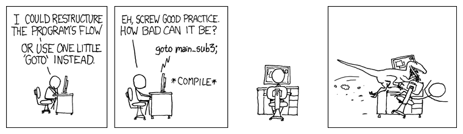

# Starting Out with Functions - A Core Concept

# 第三章 从函数开始——一个核心概念

---

上一章我们用了一个案例来介绍函数式编程思想，本章来看看函数式编程的基础知识，并回顾一下函数的相关知识点。第一章提过，`JavaScript` 的两个重要特性：

1. 函数作一等对象；
2. 函数作闭包。

本章涉及要点：

- `JavaScript` 中的函数，包括如何定义（尤其是箭头函数）；
- 函数科里化，以及作一等对象的函数；
- 以函数式编程的方式使用函数的几种方法。

学完这些内容后，您将了解与函数相关的通用及特定概念。它们是函数式编程的核心。


## 3.1. 函数面面观 All about functions

首先简要回顾一下 `JavaScript` 中函数的相关知识，厘清函数与函数式编程之间的联系。在第一章的重点论述、以及第二章的多处介绍中，我们曾提到函数可以作为一等对象，进一步考察了它们在实际编码中的使用。本节重点关注以下三个方面：

- 关于 λ 算子的一些重要的基础概念——它们是函数式编程的理论基础；
- 箭头函数——是 `Lambda` 算子在 `JavaScript` 语言的最直接的诠释；
- 视函数为一等对象——函数式编程中的一个关键概念。


### 3.1.1. `Lambda` 表达式与函数 Of lambdas and functions

一个函数按 Lambda 演算的术语要求，可以表示为：

$\lambda x.2 * x$

其中字母 λ 后的变量相当于函数的参数，句点后的表达式，是可以替换作为参数传递的任意值的地方。稍后您将看到本例按 `JavaScript` 箭头函数的语法，可以写作：`x => 2 * x`，形式上十分类似。

> **提示：arguments 与 parameter**
>
> 分清参数 `arguments` 与参数 `parameter` 之间的区别，可以借助一些押韵的顺口溜来强化记忆：*Parameters are Potential, Arguments are Actual*（参数是潜在的，参数是实际的）。`parameter` 是要传递的潜在值的占位符，而 `arguments` 是实际传给函数的值。换句话说，定义函数时，您列出的参数是 `parameter`；而当调用它时，需要提供 `arguments`。

应用一个函数，是指如同平时写代码那样，使用括号向其提供实际的参数（`arguments`）。例如，$(\lambda x.2*x)(3)$ 的值为 6。这些 `Lambda` 函数在 `JavaScript` 下的等效形式是什么样的呢？这是个值得探讨的问题，因为定义函数的方法有好几种，并且它们在含义上并不完全相同。

> **拓展阅读**
>
> 有篇不错的文章介绍了函数及方法定义的多种不同方式，不妨了解一下，具体详见 *Leo Balter* 及 *Rick Waldron* 的文章：[The Many Faces of Functions in JavaScript](https://bocoup.com/blog/the-many-faces-of-functions-in-javascript)（`JavaScript` 中函数的多种表现形式）。

您能用多少种方式定义一个 `JavaScript` 函数呢？答案可能比您原以为的要多。至少可以写出以下几种：

1. 具名函数声明：`function first(...) {...};`
2. 匿名函数表达式：`var second = function(...) {...};`
3. 具名函数表达式：`var third = function someName(...) {...};`
4. `IIFE` 立即引用表达式：`var fourth = (function() { ...; return function(...) {...}; })();`
5. 构造函数：`var fifth = new Function(...);`
6. 箭头函数：`var sixth = (...) => {...};`

此外，你还也可以添加对象方法声明，因为它们也隐含了函数的成分。不过上述清单已经够用了。

那么，这些函数定义方法的区别在哪儿？为什么值得关注呢？让我们一个一个来考察：

> **提示**
>
> `JavaScript` 还可以定义生成器函数（`generator function`），形如 `function*(...) {...}`，返回一个生成器对象 `Generator`；以及定义异步函数（`async function`），其实质为 `generator` 与 `promise` 的结合。本节不使用这三种函数，更多详情参考 `MDN` 这两篇文档：
>
> - [MDN 文档之 function*](https://developer.mozilla.org/en/docs/Web/JavaScript/Reference/Statements/function*);
> - [MDN 文档之 async function](https://developer.mozilla.org/en-US/docs/Web/JavaScript/Reference/Statements/async_function)

1. 第一种定义，以关键字 `function` 开头的独立声明形式，应该是 `JavaScript` 中最常见的定义方式。这里定义了一个名为 `first` 的函数（即 `first.name=="first"`）由于变量提升效应，该函数将在其定义的作用域内可随处任意访问。关于变量提升效应，详见 [MDN 文档](https://developer.mozilla.org/en-US/docs/Glossary/Hoisting)，只需记住一点：该效应只作用于变量声明，而非变量初始化。

2. 第二种定义，将函数赋给一个变量，也能得到一个函数，只不过是个匿名函数（即没有命名）。然而不少 `JavaScript` 引擎是可以推断出函数名称的，例如设定本例中的 `second.name === "second"`。（观察下面的示例代码，函数名称没有赋给匿名函数）鉴于变量提升效应不提升变量赋值，该函数只能在赋值之后的代码位置方可访问；再者，您可能更倾向于使用 `const` 而非 `var` 来定义该变量，因为不太会（也不应该）改变该函数：

   ```js
   var second = function() {};
   console.log(second.name);
   // "second"
   
   var myArray = new Array(3);
   myArray[1] = function() {};
   console.log(myArray[1].name);
   // ""
   ```

   

3. 第三种定义，与第二种相同，只是此时的函数拥有其自己的名称：`third.name === "someName"`。

> **提示**
>
> 函数的名称与您调用的时机有关，在执行递归调用时更是如此。第九章《函数设计——递归》中还会详细论述这一点。如果只想要一个回调函数，您可以使用一个没有名称的函数；但要注意，在错误回溯中，当您试图了解代码报错时使用的列表类型，以及哪个函数调用了什么的时候，命名函数更容易被识别。

4. 第四种定义的 `IIFE` 立即引用表达式使用了闭包的知识。内部函数可以以完全私有、被封装的方式，访问在其外部函数中定义的变量或其他函数。回顾第一章闭包一节定义的计次函数，可以编写如下代码：

   ```js
   var myCounter = (function(initialValue = 0) {
       let count = initialValue;
       return function() {
           count++;
           return count;
       };
   })(77);
   
   myCounter(); // 78
   myCounter(); // 79
   myCounter(); // 80
   ```

   仔细钻研这段代码，外部函数接收一个参数 77 作为 `count` 的初值（默认为 0）。由于闭包的缘故，内部函数可以访问到 `count`。从各方面看，返回的函数都是一个通用函数——唯一的区别在于它访问了私有元素。 这也是模块型设计模式（`module pattern`）的基础。

5. 第五类定义由于不安全，还是不用的好。这种方式首先传入参数列表，然后是一个字符串形式的函数体，用到了与调用 `eval()` 相同的方式创建函数。这可能招致很多危险的黑客攻击，所以不要用这类定义。为满足读者的好奇心，这里给出一个根据第一章展开运算符小节重写后的 `sum3` 函数示例：

   ```js
   var sum3 = new Function("x", "y", "z", "var t = x + y + z; return t;");
   sum3(4, 6, 7); // 17
   ```

   > **拓展**
   >
   > 这类定义不仅不安全，还有其他坑——不会在其创建函数的上下文中创建闭包，因此这些私有变量都是全局的。详见 [MDN 文档](https://developer.mozilla.org/en-US/docs/Web/JavaScript/Reference/Global_Objects/Function)。切记，用这种方式创建函数是下下策。
   >
   > 续：MDN 原文为：使用 `Function` 构造函数创建的函数不会为其创建上下文（`creation context`）创建闭包； 它们总是在全局范围内创建。 运行它们时，它们将只能访问自己的局部变量和全局变量，而不能访问创建 `Function` 构造函数的作用域内的变量。 这不同于将 `eval()` 与函数表达式的代码一起使用。
   >
   > 以下是文档提供的示例代码：
   >
   > ```js
   > var x = 10;
   > 
   > function createFunction1() {
   >     var x = 20;
   >     return new Function('return x;'); // this |x| refers global |x|
   > }
   > 
   > function createFunction2() {
   >     var x = 20;
   >     function f() {
   >         return x; // this |x| refers local |x| above
   >     }
   >     return f;
   > }
   > 
   > var f1 = createFunction1();
   > console.log(f1());          // 10
   > var f2 = createFunction2();
   > console.log(f2());          // 20
   > ```

6. 最后一种定义，使用带 `=>` 符号的箭头函数定义，是代码最为紧凑的一种定义方式，也是我们将尽可能尝试使用的方式。

至此，我们已经考察了定义函数的若干种方式，接下来重点关注箭头函数，这也是本书力荐的一种代码风格。


### 3.1.2. 箭头函数——更流行的方式 Arrow functions – the modern way

尽管箭头函数与其他函数的工作原理非常类似，但与普通函数相比还是有一些重要的区别。箭头函数可以不带 `return` 语句隐式地返回某个值、同时也没有绑定 `this` 的操作、不存在 `arguments` 对象。一起来看看这三个区别吧。

> **提示**
>
> 箭头函数还有其它不同之处：不能作构造函数使用、没有 `prototype` 属性、由于不支持 `yield` 也不能用作生成器（`generator`）。详情参考 [MDN 文档页](https://developer.mozilla.org/en-US/docs/Web/JavaScript/Reference/Functions/Arrow_functions#No_binding_of_this)。

In this section, we'll go into several JavaScript function-related topics, including:

本节我们将讨论以下几个与 `JavaScript` 函数相关的话题：

1. 不同函数返回值的处理；
2. `this` 取值问题的处理；
3. 参数个数不固定时的处理；
4. **科里化**（`currying`）的相关知识（一个后续章节将会多次用到的重要概念）。


#### 1. 返回值 Returning values

按照 `Lambda` 演算的编码风格，函数由一个结果构成。简化起见，新引入的箭头函数也提供了相应的语法支持。当写作 `(x, y, z) =>` 并后跟一个表达式时，就隐式包含了一个 `return` 语句。例如下面的两个函数就与前文演示的 `sum3()` 函数效果相同：

```js
const f1 = (x, y, z) => x + y + z;

const f2 = (x, y, z) => {
    return x + y + z;
};
```

如若返回的是一个对象，则必须添加小括号，否则 `JavaScript` 会误以为后面跟的是代码。

> **小贴士**
>
> 注意箭头函数的编码风格：定义一个单参数函数时，可以忽略两边的小括号。为连贯起见，笔者更倾向于保留括号。然而本书用到的格式化工具 `Prettier` 则倾向于默认不保留。读者可根据个人喜好随意选择。

需要注意的最后一点：未避免您认为这是一个不大可能的情况，请移步至本章 **思考题** 小节，查看一个非常常见的情况！


#### 2. `this` 值的处理 Handling the this value

`JavaScript` 的一个经典问题是 `this` 的处理，其具体取值往往并不按您想象的来。`ES2015` 借助箭头函数解决了 `this` 的指向问题。来看下面这个例子：超时函数被调用时，`this` 会指向全局变量（`window`）而非新的对象，因此控制台输出的是 `undefined`：

```js
function ShowItself1(identity) {
    this.identity = identity;
    setTimeout(function() {
        console.log(this.identity);
    }, 1000);
}

var x = new ShowItself1("Functional");
// 一秒后显示 undefined
```

解决这个问题，旧版 `JavaScript` 有两个经典方案，以及新版的箭头函数方案：

- 旧版方案一：利用闭包的特性，定义一个本地变量（通常命名为 `that` 或 `self`），这样就能获取到想要的值，而非 `undefined`；
- 旧版方案二：使用 `bind()` 函数，将超时函数绑定到正确的值上；
- 箭头函数版：这是更流行的写法，无需其他改动就能获取到正确的值（直接指向对象）。

> **提示**
>
> 本书同样会使用 `bind()`，详见 3.1.1 小节《表达式与函数 Of lambdas and functions》。

三种方案的代码实现如下：第一个 `timeout` 函数使用了闭包，第二个用到了函数绑定，第三个用到了箭头函数：

```js
function ShowItself2(identity) {
    this.identity = identity;
    let that = this;
    setTimeout(function() {
        console.log(that.identity);
    }, 1000);

    setTimeout(
        function() {
            console.log(this.identity);
        }.bind(this),
        2000
    );

    setTimeout(() => {
        console.log(this.identity);
    }, 3000);
}

var x = new ShowItself2("JavaScript");
// 一秒后显示 "JavaScript"
// 再过一秒同样显示 "JavaScript"
// 又过一秒还是显示 "JavaScript"
```

三种方法都能正确运行，具体选哪一个视个人喜好决定。


#### 3. `arguments` 的处理 Working with arguments

前两章曾提到展开运算符（`...`）的使用。然而我们后续用得最多的场景是对 `arguments` 对象的处理（第六章详述）。先来重温上一章的 `once()` 函数：

```js
const once = func => {
  let done = false;
  return (...args) => {
    if (!done) {
      done = true;
      func(...args);
    }
  };
};
```

为什么在写了 `return (...args) =>` 这句后，第 6 行又接着调用了 `func(...args)` 呢？旧版 `JavaScript` 是怎么处理这个问题的呢？这需要用到 `arguments` 对象（**不是** 数组！）来访问实际传入的参数。

> **小贴士**
>
> 更多 `arguments` 的介绍，详见 [MDN 官方文档](https://developer.mozilla.org/en/docs/Web/JavaScript/Reference/Functions/arguments)。

在 `JavaScript` 5 及以前，若要得到一个能处理任意数量参数的函数，代码需要像这样写：

```js
function somethingElse() {
    // get arguments and do something
}

function listArguments() {
    console.log(arguments);
    var myArray = Array.prototype.slice.call(arguments);
    console.log(myArray);
    somethingElse.apply(null, myArray);
}

listArguments(22, 9, 60);
// (3) [22, 9, 60, callee: function, Symbol(Symbol.iterator): function]
// (3) [22, 9, 60]
```

第一句日志输出的是一个对象；第二句才出一个普通数组。还要注意调用 `somethingElse()` 函数的复杂写法，这里用到了 `apply()`（签名为 `func.apply(thisArg, [argsArray])`）。

那么新版 `JavaScript` 会怎么处理呢？新版的代码要简短得多，这也是您后续将多次看到展开运算符的身影的原因：

```js
function listArguments2(...args) {
    console.log(args);
    somethingElse(...args);
}

listArguments2(12, 4, 56);
// (3) [12, 4, 56]
```

查看上述代码您需要牢记以下三点：

- 写下 `listArguments2(...args)` 表明新函数将接收若干个参数（也可能没有参数）；
- 无需手动构造一个参数数组，控制台的结果可以看到 `args` 就是一个数组；
- `somethingElse(...args)` 的写法较 `apply()` 的写法更清晰明了。

顺便说一下，新版 `JS` 中的 `arguments` 对象同样是有效的，若要根据 `arguments` 创建新函数，可以使用以下两种变通方案来替换 `Array.prototype.slice.call`：

- 使用 `Array.from`：`var myArray=Array.from(arguments)`；
- 使用 `[] + ...`：`let myArray=[...arguments]`。这也是展开运算符的另一种用法。

When we get to the topic of higher-order functions, writing functions that deal with other functions, with a possibly unknown number of parameters, will be commonplace.

这在我们后续讲高阶函数时，需要用函数来处理其它参数数量不固定的函数时，尤为常见。

`JavaScript` 为这类问题提供了简便写法，因此必须尽快习惯这类写法，很划算。


#### 4. 单参数还是多参数？ One argument or many?

编写一个返回值为函数的函数也是可以的（第六章详述）。例如，按 Lambda 算子的演算要求，所用的函数没有多个参数的情况，只有一个参数；这时可以通过一项称为函数科里化（`currying`）的处理来满足需求（这么做用意何在呢？先按下不表）

> **提示**
>
> 科里化（`Currying`）得名于这一概念的提出者 ***Haskell Curry***。值得一提的是，有一门函数式编程语言也被冠名为 `Haskell`，这也是对他所做贡献的双重认可。

几个例子，之前演示过的三数相加的函数可以写作：

```js
const altSum3 = x => y => z => x + y + z;
```

为什么这里重命名了呢？简单讲，该函数与之前定义的函数 `sum3()` 不同。尽管如此，它也有异曲同工之妙，只是侧重点不同罢了。来看看它的具体使用：例如对数字 1、2 和 3 求和：

```js
altSum3(1)(2)(3); // 6
```

> **提示**
>
> 继续往下读之前，不妨做个小测试：如果执行 `altSum3(1, 2, 3)`，会得到什么？提示：结果并非是个数字！完整答案参见下文。

该函数是怎么运作的呢？不妨将其拆分为多次调用，这也是上面那句表达式在 `JavaScript` 解释器上的计算方式：

```js
let fn1 = altSum3(1);
let fn2 = fn1(2);
let fn3 = fn2(3);
```

动用您的函数式思维！根据定义，调用 `altSum3(1)` 的结果，应该是一个函数。该函数利用了闭包，可以等效解析为如下形式：

```js
let fn1 = y => z => 1 + y + z;
```

这里的 `altSum3()` 函数接收的是单参数，而非三个参数；而其结果，`fn1`，也是一个接收单参数的函数。运行 `fn1(2)` 的结果同样是一个函数，同样也只接收一个参数，等效形式如下：

```js
let fn2 = z => 1 + 2 + z;
```

再运行 `fn2(3)`，得到最终结果。如前所述，函数执行的是相同的运算，但实现方式上有着天壤之别。

您可能觉得柯里化只是一个特殊的技巧：谁会只调用单参数的函数呢？后续在第八章《连接函数——管道与组合》以及第十二章《构筑更好的容器——函数式的数据类型》中考虑如何将函数连接在一起时，您将看到其中的原因，届时将多个参数从上一步传递到下一步的操作是不被允许的。


### 3.1.3. 将函数用作对象 Functions as objects

所谓一等对象，是指函数本身可以诸如数字或字符串那样，被创建、赋值、变更、被传入参数，以及像其他数据类型那样被其它函数作为返回值返回。先来看看函数的常规定义方式：

```js
function xyzzy(...) { ... }
```

这类声明与下面的语句大抵等效：

```js
var xyzzy = function(...) { ... }
```

这里的“等效”对变量提升效应不适用。变量提升效应只提升变量的 **声明部分** 而非 **赋值部分** 到当前作用域顶部。因此，对于第一个定义，函数调用可以在代码任一位置生效；而第二个定义中，函数调用只在该赋值语句执行后生效。

> 拓展
>
> 发现与游戏巨穴冒险（Colossal Cave Adventure）的相似之处了吗？在任何地方调用 `xyzzy(...)` 并不总是有效！如果您还从未玩过那个著名的互动虚拟游戏，不妨在线试试——访问 [地址1](http://www.web-adventures.org/cgi-bin/webfrotz?s=Adventure) 或 [地址2](http://www.amc .com/shows/halt-and-catch-fire/colossal-cave-adventure/landing) 即可。

这里想说明的点在于函数可以被赋值给一个变量，如果需要的话也可以重新赋值。类似地，我们可以在需要时临时定义函数。甚至可以不对函数命名：与普通表达式一样，如果只调用一次，则无需命名或赋值给一个变量。


#### 1. `React-Redux` 中的 `reducer` A React-Redux reducer

来看另一个关于函数赋值的示例。如前所述，`React-Redux` 的工作原理是分发由 `reducer` 处理的 `action` 操作对象。 通常 `reducer` 含有一段像这样的带开关的代码：

```js
function doAction(state = initialState, action) {
    let newState = {};
    switch (action.type) {
        case "CREATE":
            // update state, generating newState,
            // depending on the action data
            // to create a new item
            return newState;

        case "DELETE":
            // update state, generating newState,
            // after deleting an item
            return newState;

        case "UPDATE":
            // update an item,
            // and generate an updated state
            return newState;

        default:
            return state;
    }
}
```

> **提示**
>
> 将 `initialState` 作为 `state` 的默认值，是首次初始化全局状态时的简单处理手法。别去死盯着那个默认值， 它与本例演示的重点无关，这里只是为了要素完整起见而引入的。

利用存储函数的可能性，不妨构建一个 **调度表** 来简化上述代码。首先，使用每个 `action` 动作类型的函数代码来初始化一个对象。

基本上，我们只是采用前面的代码创建出单独的函数：

```js
const dispatchTable = {
    CREATE: (state, action) => {
        // update state, generating newState,
        // depending on the action data
        // to create a new item
        return newState;
    },

    DELETE: (state, action) => {
        // update state, generating newState,
        // after deleting an item
        return newState;
    },

    UPDATE: (state, action) => {
        // update an item,
        // and generate an updated state
        return newState;
    }
};
```

我们将处理每类 `action` 的函数作为某对象的属性存到一个对象中，该对象即为我们需要的调度表。这个调度表对象只需要创建一次，就能在应用程序执行期间保持不变。这样就能用一行代码重写前面的 `action` 处理逻辑：

```js
function doAction2(state = initialState, action) {
  return dispatchTable[action.type]
    ? dispatchTable[action.type](state, action)
    : state;
}
```

来仔细分析一下这段代码：给定一个 `action`，若 `action.type` 匹配到了调度表对象中的某一属性，则执行该属性对应的处理函数，返回一个新状态；否则只返回 `Redux` 所需的当前状态。如若不能将函数（存储及调用）作为一等对象处理，那么上述代码是无法满足需求的。


#### 2. 不必要的错误 An unnecessary mistake

这里通常会出现一个常见的、无伤大雅的错误（虽然并无公害）。您可能经常看到像这样的代码：

```js
fetch("some/remote/url").then(function(data) {
    processResult(data);
});
```

这段代码是做什么用的？大概意思是从某个远程 URL 获取到了结果后调用了一个函数。该函数又调用了 `processResult` 函数，并传入自身的参数（`data`）作为其参数。换言之，在 `then()` 的部分，我们需要一个函数，在给定 `data` 后，去执行 `processResult(data)`。但问题是，这样的函数不就是现成的么？

> **拓展**
>
> 先上理论：在 `Lambda` 演算术语中，我们将【λ*x*.*func* *x*】简单地替换为 *func* ——这称为 **eta 转换** 或 **eta 约简**。（反之，则得到一个 **eta 抽象**）。本例可被认为是做了一次（非常非常小的）优化，其主要优点是写出更简短、更紧凑的代码。

一般的原则是，只要见到类似这样的代码：

```js
function someFunction(someData) { 
    return someOtherFunction(someData);
}
```

就可以考虑用 `someOtherFunction` 进行如下替换，将本例改写为：

```js
fetch("some/remote/url").then(processResult);
```

这段代码完全等同于我们之前看到的回调逻辑（由于避免了一次函数调用，故而性能上有极细微的提升）。这样一来是否更容易理解呢？

这种编程风格被称为 **无点式（pointfree）** 风格或 **默认（tacit）** 风格，其主要特点是无需为每个函数的调用指定任何参数。这类编码方式的一个优点是帮助开发者（以及今后读到该代码的人）思考函数本身的含义，而不是费心于传参、调用这样的底层细节上。简化版本中并没有多余或不相关的调用细节：只要了解被调用函数的作用，就相当于了解了完整代码的含义。后续章节中我们还会经常（但不一定总是）见到这种写法的身影。

> **知识拓展**
>
> Unix / Linux 用户可能早就习惯了这种编码风格，因为当使用管道（pipes）将某命令的结果作为输入项传递给另一个命令时，就是以类似的方式工作的。执行命令 `ls | grep doc | sort` 时，`ls` 的输出是 `grep` 命令的输入，而后者的输出是 `sort` 的输入——但输入的参数不会显式地写出来；它们都是是隐含的。在第八章介绍无点式风格小节，我们还将继续探讨相关话题。


#### 3. 使用“方法” Working with methods

还有一种情况值得关注：在调用一个对象的方法时，会发生什么？来看下面的代码： 

```js
fetch("some/remote/url").then(function(data) {
    myObject.store(data);
});
```

如果原代码与前述代码类似，那么看似显而易见的转换将出错：

```js
fetch("some/remote/url").then(myObject.store);
```

什么原因呢？这是因为在原代码中，被调用的方法是绑定到一个对象（`myObject`）上的；而在转换后的代码中该方法并没有被绑定，它只是一个自由函数。要解决这个问题，可以使用 `bind()` 函数进行如下修复：

```js
fetch("some/remote/url").then(myObject.store.bind(myObject));
```

这是一种通用的解决方案：移植某个方法时，不能只考虑赋值；还必须使用 `bind()` 绑定原方法中正确的上下文：

```js
function doSomeMethod(someData) { 
    return someObject.someMethod(someData);
}
```

按照这个转换规则，上述代码应该转换成下面的方式后，才能以无点式风格进行传参：

```js
const doSomeMethod = someObject.someMethod.bind(someObject);
```

> **小贴士**
>
> 更多 `bind` 介绍，详见 [MDN 官方文档](https://developer.mozilla.org/en/docs/Web/JavaScript/Reference/Global_objects/Function/bind)。

这样的写法看起来很蹩脚，也不甚优雅；但为了让方法关联到正确的对象上，也只能这样写了。在第六章中我们还将看到这一写法的具体应用（将函数作 `promise` 改造时）。即便这段代码不太好看，也要务必记得：在今后不得不使用对象的方法时，一定要先完成上下文的手动绑定，然后再将该方法作为无点式风格的一等对象进行传参（记住，我们的终极目标并不是纯粹的函数式编程，我们更推崇的是兼收并蓄其他有助于简化问题的构造）。


## 3.2. 以函数式编程的方式使用函数  Using functions in FP ways

有几种常见的编码模式实际上采用了函数式编程的风格，而您甚至都未曾察觉。本节将逐一考察这些模式的具体表现形式，以便您更快地习惯这种编码风格。这些模式包括：

- 注入模式：用于筛选不同策略及其他用途；
- 回调与期约模式：将引入连续传值的相关概念；
- 填充与插入模式；
- 立即调用策略模式。


### 3.2.1. 注入——整理出来 Injection – sorting it out

`Array.prototype.sort()` 方法提供了第一个将函数作为参数传递的示例。 给定一个待排序的字符串数组，则可以调用 `array.sort()` 方法。例如，将彩虹的颜色按字母顺序排序，代码如下：

```js
var colors = [
  "violet",
  "indigo",
  "blue",
  "green",
  "yellow",
  "orange",
  "red"
];
colors.sort();
console.log(colors);
// ["blue", "green", "indigo", "orange", "red", "violet", "yellow"]
```

注意，这里的 `sort()` 方法并不需要任何参数，数组也能完成排序。默认情况下，此方法按字符串的 `ASCII` 编码进行排序。因此，如果用它对数字型数组排序则会出错，按这种方式得出的结果，数字 `20` 将位于 `100` 和 `3` 之间，因为 `100` 在 `20` 之前（排序元素均被视作字符串）而 `20` 又在 `3` 之前：

```js
var someNumbers = [3, 20, 100];
someNumbers.sort();

console.log(someNumbers);
// [100, 20, 3]
```

假如不考虑数字，只对字符串按默认规则排序。此时如果要对一组西班牙语单词（`palabras`）进行排序，在遵循恰当的本地化语言环境规则时又会如何呢？可以看到，结果并不正确：

```js
var palabras = ["ñandú", "oasis", "mano", "natural", "mítico", "musical"];
palabras.sort();

console.log(palabras);
// ["mano", "musical", "mítico", "natural", "oasis", "ñandú"] -- wrong result!
```

> **拓展知识**
>
> 对于语言或生物学爱好者而言，`ñandú` 的英文是 `rhea`，它一种类似于鸵鸟的飞禽。虽然以 `ñ` 开头的西班牙语单词并不多，而笔者的国家乌拉圭恰好就有这些鸟类——这就是存在特殊单词的客观原因。

哎呀！在西班牙语中，`ñ` 介于 `n` 和 `o` 之间，但 `ñandú` 排到了末尾。此外，`mítico`（对应英文 `mythical`，注意重音字母 `í`）本应出现在 `mano` 和 `musical` 之间，波浪号应该被忽略。要解决这个问题，需要向 `sort()` 传入正确的比较函数。本例可以使用 `localeCompare()` 方法：

```js
palabras.sort((a, b) => a.localeCompare(b, "es"));

console.log(palabras);
// ["mano", "mítico", "musical", "natural", "ñandú", "oasis"]
```

这里的语句 `a.localeCompare(b,"es")` 会对 `a` 和 `b` 进行比较：根据西班牙语（`"es"`）的排序规则，当 `a` 先于 `b` 时返回一个负值；`a` 落后于 `b` 时返回一个正值；两者相等时返回 `0`。

现在排序结果正确了！此时可引入一个新函数 `spanishComparison()` 来替换所需的字符串比较规则，可使代码更加清晰：

```js
const spanishComparison = (a, b) => a.localeCompare(b, "es");

palabras.sort(spanishComparison);
// sorts the palabras array according to Spanish rules:
// ["mano", "mítico", "musical", "natural", "ñandú", "oasis"]
```

在接下来的章节中，我们将讨论函数式编程如何让您以更贴近声明式的方式来编写代码，生成更易于理解的代码。这类微小的改变是很有帮助的：当阅读代码的人读到排序这部分时，他们就可以在不借助注释的情况下立即推断出将会执行的逻辑。

> **小贴士**
>
> 这种通过注入不同的比较函数来改变 `sort()` 函数工作方式的模式，实际上是策略设计模式的一种表现形式。第 11 章《实现函数式的设计模式》会具体论述。

提供一个排序函数作为参数（典型的函数式编程风格）还有助于解决其他问题，例如：

- `sort()` 仅适用于字符串。要对数字进行排序，必须提供一个数字排序函数，如：`myNumbers.sort((a,b) => a-b)`；
- 如要按给定属性对对象排序，则需要传入一个与该属性值进行比较的函数。如：`myPeople.sort((a,b) => a.age - b.age)` 可以按年龄升序对人员进行排序。

> **小贴士**
>
> 更多 `localeCompare()` 介绍，请参阅 [MDN 官方文档](https://developer.mozilla.org/en/docs/Web/JavaScript/Reference/Global_Objects/String/localeCompare)。您可以指定区域规则、大小写字母的排序规则以及是否忽略标点符号等。但请注意：并非所有浏览器都支持所需的额外参数。

这是一个您以前可能用过的简单示例，但它毕竟是一种函数式编程模式。接下来让我们来看看调用 `Ajax` 时将函数作为参数的更常见用法。


### 3.2.2. 回调、期约及延续 Callbacks, promises, and continuations

作一等对象传参的函数最常用的示例应该就是回调（`callbacks`）和期约（`promises`）了。在 `Node` 环境下，读取文件是异步完成的：

```js
const fs = require("fs");

fs.readFile("someFile.txt", (err, data) => {
    if (err) {
        console.error(err); // or throw an error, or otherwise handle the problem
    } else {
        console.log(data.toString()); // do something with the data
    }
});
```

`readFile()` 需要一个回调函数——本例为一个匿名函数——它将在文件读取操作完成时被调用。

更好的方法是使用 `Promise`，详细介绍参考 [MDN 文档](https://developer.mozilla.org/en-US/docs/Web/JavaScript/Reference/Global_Objects/Promise)。有了 `Promise`，当使用更现代的 `fetch()` 函数执行 `Ajax` 调用 `Web` 服务时，可以按以下代码执行一些逻辑：

```js
fetch("some/remote/url")
  .then(data => {
    // Do some work with the returned data
  })
  .catch(error => {
    // Process all errors here
  });
```

> **提示**
>
> 请注意，如果定义了适当的 `processData(data)` 和 `processError(error)` 函数，则代码可以像之前提过的那样，精简为 `fetch("some/remote/url").then(processData).catch(processError)`。

最后，还应该考虑使用 `async / await`，具体用法详见 [MDN 文档](https://developer.mozilla.org/en-US/docs/Web/JavaScript/Reference/Statements/async_function [和 ](https://developer.mozilla.org/en-US/docs/ Web/JavaScript/Reference/Statements/async_function) https://developer.mozilla.org/en-US/docs/Web/JavaScript/Reference/Operators/await)。


### 3.2.3. 连续传递风格 Continuation passing style

前面的代码，在调用一个函数的同时，还传递了另一个在 I/O 操作完成时要执行的函数，可以认为是 **连续传递风格**（**CPS，Continuation Passing Style**）的一种具体体现。这是一种什么样的编码技术呢？不妨从一个实际问题切入理解：如果禁止使用 `return` 语句，该怎样编程？

乍一看，这个问题似乎无从下手。然而，通过 **将回调传函数递给被调用函数**，我们便能寻得解决之道：当该过程准备返回控制权给调用者时，它不会实际返回，而是去调用所传递的回调函数。这么一来，回调函数就为被调用函数提供了延续该操作过程的一种途径，`CPS` 风格中的“连续”（`continuation`）就是这么来的。`CPS` 风格本节不具体展开，留待第九章《函数设计——递归》再进行深入研究。值得一提的是，正如我们将看到的那样，`CPS` 风格将有助于规避递归中的一个重要限制。

弄清“连续”的具体用法，有时是一件颇具挑战的事，但总归是能够达成的。这种编码方式一个有趣的好处在于，通过指定程序的接续方式，可以打破所有常见的程序控制结构（`if`、`while`、`return` 等等），实现想要的任何控制流程。对于处理过程未必是线性的某些问题而言，这类编码风格将会非常有用。当然，这也可能导致您新发明的某种控制结构，远比想象中使用 `GOTO` 语句的后果更为糟糕！这种做法的危险如下图所示：



<p align="center" style="font-weight: bolder;">图 3.1 弄乱程序流程，可能会发生什么更糟糕的情况呢？</p>

> **拓展**
>
> 这部 `XKCD` 漫画可以在 [这里](https://xkcd.com/292/) 在线访问。

此外，可供传递的“连续”体也可以不止一个。就像 `Promise` 那样，可以提供两个或多个回调逻辑参与传递。顺便说一句，这一特性可用于异常处理领域：如果只是允许一个函数可以抛出一个错误，那么该错误就很可能潜在地返回给调用者，而事实上我们并不希望这样。解决问题的关键在于：提供另一个专门处理报错的回调函数（即不同的连续体），以便在抛出异常时使用（第十二章《构建更好的容器——函数式数据类型》将提出一个基于 `monads` 的新解决方案）：

```js
function doSomething(a, b, c, normalContinuation, errorContinuation) {
  let r = 0;
  // ... do some calculations involving a, b, and c,
  // and store the result in r
    
  // if an error happens, invoke:
  // errorContinuation("description of the error")
    
  // otherwise, invoke:
  // normalContinuation(r)
}
```

利用 `CPS` 甚至可以超越 `JavaScript` 现有的控制结构，但这超出了本书的讨论范围，感兴趣的读者可自行研究。


### 3.2.4. 填充脚本 Polyfills

就像为普通变量赋值那样，能够对函数动态赋值的做法，还能在定义 `polyfill` 时更高效。

#### 1. 检测 `Ajax` Detecting Ajax

回到 `Ajax` 刚开始出现的年代，鉴于不同的浏览器以不同的方式实现了 `Ajax` 调用，编写代码时必须考虑这些实现差异。 以下代码演示了 `Ajax` 调用的特性检测逻辑：

```js
function getAjax() {
    let ajax = null;
    if (window.XMLHttpRequest) {
        // modern browser? use XMLHttpRequest
        ajax = new XMLHttpRequest();

    } else if (window.ActiveXObject) {
        // otherwise, use ActiveX for IE5 and IE6
        ajax = new ActiveXObject("Microsoft.XMLHTTP");

    } else {
        throw new Error("No Ajax support!");
    }

    return ajax;
}
```

这段代码是行得通的，但也意味着每次调用都要进行 `Ajax` 检测，即便测试结果永远不变。其实利用函数作一等对象，可以得到一种更有效的实现方式：定义两个不同的函数，其中一个完成特性检测且只执行一次，然后将正确的实现逻辑赋给另一个函数，以供后续调用。代码如下：

```js
(function initializeGetAjax() {
  let myAjax = null;

  if (window.XMLHttpRequest) {
    // modern browsers? use XMLHttpRequest
    myAjax = function() {
      return new XMLHttpRequest();
    };
        
  } else if (window.ActiveXObject) {
    // it's ActiveX for IE5 and IE6
    myAjax = function() {
      new ActiveXObject("Microsoft.XMLHTTP");
    };
        
  } else {
    myAjax = function() {
      throw new Error("No Ajax support!");
    };
  }
    
  window.getAjax = myAjax;
})();
```

这段代码演示了两个重要概念：

1. 可以对函数动态赋值：运行代码，`window.getAjax`（即全局 `getAjax` 变量）会根据当前浏览器获取到三个候选项之一。稍后调用 `getAjax()` 时，将执行正确的函数，无需再进行任何浏览器特性检测；
2. 定义了 `initializeGetAjax` 函数并立即执行——该模式称为 **立即调用函数表达式（IIFE）**。函数按预期运行并在完成逻辑后自行清理内存，因为它的所有变量都是局部变量，甚至在函数运行结束后就不存在了。


#### 2. 补缺函数 Adding missing functions

这种在运行时定义函数的想法也可用于编写填充脚本 `polyfills` 来提供其他缺失的函数。例如，所需代码逻辑如下：

```js
if (currentName.indexOf("Mr.") !== -1) {
    // it's a man
    ...
}
```

可能您更喜欢下面这样的新版实现：

```js
if (currentName.includes("Mr.")) {
    // it's a man
    ...
}
```

假设浏览器不支持 `.includes()` 怎么办呢？同样，我们可以按需定义想要的函数：若 `.includes()` 可用，则什么都不动；否则定义一个 `polyfill` 来实现同样的逻辑。代码如下：

> **小贴士**
>
> `Mozilla` 开发者网站为新版 `JavaScript` 特性提供了大量填充脚本。例如，可以直接从 [官方文档](https://developer.mozilla.org/en/docs/Web/JavaScript/Reference/Global_Objects/String/includes) 获取到 `includes` 的实现。

```js
if (!String.prototype.includes) {
    String.prototype.includes = function(search, start) {
        "use strict";
        if (typeof start !== "number") {
            start = 0;
        }

        if (start + search.length > this.length) {
            return false;
        } else {
            return this.indexOf(search, start) !== -1;
        }
    };
}
```

这段代码在运行时它会检查 `String` 原型是否已实现 `include` 方法。若没有，则会为其定义一个执行相同逻辑的函数；此后便都能使用 `.includes()` 了。顺便提一下，还有其他定义 `polyfill` 的方法，详见 **思考题** 3.5。

> **提示**
>
> 直接修改标准类型的原型对象通常是不被接受的，因为本质上相当于使用了全局变量，容易出错；然而，为一个成熟且已知的函数编写一个 `polyfill` 这种情况是不大可能引发什么代码冲突的。

最后，如果您碰巧认为前面演示的 `Ajax` 示例已经过时，那么请考虑一下这个场景：若要使用更现代的 `fetch()` 调用服务，您还会发现并非所有现代浏览器都支持该 API（查看 http://caniuse.com/#search=fetch 验证），因此您必须使用 `polyfill`，例如 https://github.com/github/fetch 上的那版。研究上面的源码，会发现它基本上也用到了与前面相同的方法：检测是否需要 `polyfill`，需要则创建一个。


### 3.2.5. 插入处理 Stubbing

Here, we will look at a use case that is similar in some aspects to using a polyfill: having a function do different work depending on the environment. The idea is to perform **stubbing**, an idea that comes from testing that involves replacing a function with another that does a simpler job, instead of doing the actual work.

Stubbing is commonly used with logging functions. You may want the application to perform detailed logging when in development, but not to say a peep when in production. A common solution would be to write something along the lines of the following:

```js
let myLog = someText => {
  if (DEVELOPMENT) {
    console.log(someText); // or some other way of logging
  } else {
    // do nothing
  }
}
```

This works, but as in the example of Ajax detection, it does more work than it needs to because it checks whether the application is in development every time.

We could simplify the code (and get a really, really tiny performance gain!) if we stub out the logging function so that it won't actually log anything; an easy implementation is as follows:

```js
let myLog;
if (DEVELOPMENT) {
  myLog = someText => console.log(someText);
} else {
  myLog = someText => {};
}
```

We can even do better with the ternary operator:

```js
const myLog = DEVELOPMENT
  ? someText => console.log(someText)
  : someText => {};
```

This is a bit more cryptic, but I prefer it because it uses a const, which cannot be modified.

> **ProTip**
>
> Given that JavaScript allows us to call functions with more parameters than arguments, and given that we aren't doing anything in myLog() when we are not in development, we could also have written () => {} and it would have worked fine. However, I do prefer keeping the same signature, and that's why I specified the someText argument, even if it wouldn't be used. It's your call!

You'll notice that we are using the concept of functions as first-class objects over and over again; look through all the code samples and you'll see!


### 3.2.6. 立即调用 Immediate invocation

There's yet another common usage of functions, usually seen in popular libraries and frameworks, that lets you bring some modularity advantages from other languages into JavaScript (even the older versions!). The usual way of writing this is something like the following:

```js
(function() {
  // do something...
})();
```

> ProTip
>
> Another equivalent style is (function(){ ... }())—note the different placement of the parentheses for the function call. Both styles have their fans; pick whichever suits you, but just follow it consistently.

You can also have the same style, but pass some arguments to the function that will be used as the initial values for its parameters:

```js
(function(a, b) {
  // do something, using the
  // received arguments for a and b...
})(some, values);
```

Finally, you could also return something from the function:

```js
let x = (function(a, b) {
  // ...return an object or function
})(some, values);
```

As we mentioned previously, the pattern itself is called the IIFE (pronounced *iffy*). The name is easy to understand: you are defining a function and calling it right away, so it gets executed on the spot. Why would you do this, instead of simply writing the code inline? The reason has to do with scopes.

> InfoBox
>
> Note the parentheses around the function. These help the parser understand that we are writing an expression. If you were to omit the first set of parentheses, JavaScript would think you were writing a function declaration instead of an invocation. The parentheses also serve as a visual note, so readers of your code will immediately recognize the IIFE. 

If you define any variables or functions within the IIFE, then because of how JavaScript defines the scope of functions, those definitions will be internal, and no other part of your code will be able to access them. Imagine that you wanted to write some complicated initialization, like the following:

```js
function ready() { ... }

function set() { ... }

function go() { ... }

// initialize things calling ready(),
// set() and go() appropriately
```

What could go wrong? The problem hinges on the fact that you could (by accident) have a function with the same name of any of the three here, and hoisting would imply that the *last* function would be called:

```js
function ready() {
  console.log("ready");
}

function set() {
  console.log("set");
}

function go() {
  console.log("go");
}

ready();
set();
go();

function set() {
  console.log("UNEXPECTED...");
}
// "ready"
// "UNEXPECTED"
// "go"
```

Oops! If you had used an IIFE, the problem wouldn't have happened. Also, the three inner functions wouldn't even be visible to the rest of the code, which helps to keep the global namespace less polluted. The following code shows a very common pattern for this:

```js
(function() {
  function ready() {
    console.log("ready");
  }

  function set() {
    console.log("set");
  }

  function go() {
    console.log("go");
  }

  ready();
  set();
  go();
})();

function set() {
  console.log("UNEXPECTED...");
}
// "ready"
// "set"
// "go"
```

To see an example involving returned values, we could revisit the example from [Chapter 1](https://subscription.packtpub.com/book/web_development/9781839213069/4/ch04lvl1sec16/usingfunctions-in-fp-ways), *Becoming Functional - Several Questions*, and write the following, which would create a single counter:

```js
const myCounter = (function() {
  let count = 0;
  return function() {
    count++;
    return count;
  };
})();
```

Then, every call to myCounter() would return an incremented count, but there is no chance that any other part of your code will overwrite the inner count variable because it's only accessible within the returned function. 


## 3.3. 小结

In this chapter, we went over several ways of defining functions in JavaScript, focusing mainly on arrow functions, which have several advantages over standard functions, including being terser. We learned about the concept of currying (which we'll be revisiting later), considered some aspects of functions as first-class objects, and lastly, we considered several techniques that happen to be fully FP in concept. Rest assured that we'll be using everything in this chapter as the building blocks for more advanced techniques in the rest of the book; just wait and see!

In [Chapter 4](https://subscription.packtpub.com/book/web_development/9781839213069/4/ch04lvl1sec16/usingfunctions-in-fp-ways), *Behaving Properly – Pure Functions*, we will delve even more deeply into functions and learn about the concept of *pure functions*, which will lead us to an even better style of programming. 


## 3.4. 思考题

3.1 **Uninitialized object?** React-Redux programmers usually code **action creators** to simplify the creation of actions that will later be processed by a reducer. Actions are objects, which must include a type attribute that is used to determine what kind of action you are dispatching. The following code supposedly does this, but can you explain the unexpected results?

```js
const simpleAction = t => {
 type: t;
};

console.log(simpleAction("INITIALIZE"));
// undefined
```

3.2. **Are arrows allowed?** Would everything be the same if you defined listArguments() and listArguments2() from the *Working with arguments* section by using arrow functions instead of the way we did, with the function keyword?

3.3. **One liner**: Some programmer, particularly thrifty with lines of code, suggested rewriting doAction2() as a one-liner, even though you can't tell this from the formatting! What do you think: is it correct or isn't it?

```js
const doAction3 = (state = initialState, action) =>
  (dispatchTable[action.type] &&
    dispatchTable[action.type](state, action)) ||
  state;
```

3.4. **Spot the bug!** A programmer, working with a global store for state (similar in concept to those of Redux, Mobx, Vuex, and others used by different web frameworks) wanted to log (for debugging purposes) all calls to the store's set() method. After creating the new store object, he wrote the following so that the arguments to store.set() would be logged before actually being processed. Unfortunately, the code didn't work as expected. What's the problem? Can you spot the mistake?

```js
window.store = new Store();
const oldSet = window.store.set;
window.store.set = (...data) => (console.log(...data), oldSet(...data));
```

3.5. **Bindless binding**: Suppose that bind() was not available; how could you do a polyfill for it?


> **参考答案**

3.1. **Uninitialized object?** The key is that we didn't wrap the returned object in parentheses, so JavaScript thinks the braces enclose the code to be executed. In this case, type is considered to be labeling a statement, which doesn't really do anything: it's an expression (t) that isn't used. Due to this, the code is considered valid, and since it doesn't have an explicit return statement, the implicit returned value is undefined. See https://developer.mozilla.org/en-US/docs/Web/JavaScript/Reference/Statements/label for more on labels, and https://developer.mozilla.org/en-US/docs/Web/JavaScript/Reference/Functions/Arrow_functions#Returning_object_literals for more on returning objects. The corrected code is as follows:

```js
const simpleAction = t => ({
    type: t;
});
```

3.2. **Are arrows allowed?** There would be no problems with listArguments2(), but with listArguments(), you would get an error since arguments is not defined for arrow functions:

```js
listArguments(22,9,60); 
Uncaught ReferenceError: arguments is not defined
```

3.3. **One-liner**: It works! (And yes, a one-line answer is appropriate in this case!).

3.4. **Spot the bug!** Initially, many people look at the weird (console(...), window.store.set(...)) code, but the bug isn't there: because of how the comma operator works, JavaScript does the logging first, and then the setting. The real problem is that oldSet() is not bound to the window.store object, so the second line should be as follows instead:

```js
const oldSet = window.store.set.bind(window.store);
```

Reread the *Working with methods* section for more on this, as well as question *11.1* for another way of doing logging, that is, with decorators.

3.5. **Bindless binding**: If bind() wasn't available, you could use a closure, the that trick (which we saw in the *Handling the* *this* *value* section), and the apply() method, as follows:

```js
function bind(context) {
  var that = this;
  return function() {
    return that.apply(context, arguments);
  };
}
```

We could do something similar to what we did in the *Adding missing functions* section. Alternatively, just for variety, we could use a common idiom based on the || operator: if Function.prototype.bind exists, evaluation stops right there, and the existing bind() method is used; otherwise, our new function is applied:

```js
Function.prototype.bind =
  Function.prototype.bind ||
  function(context) {
    var that = this;
    return function() {
      return that.apply(context, arguments);
    };
  };
```

