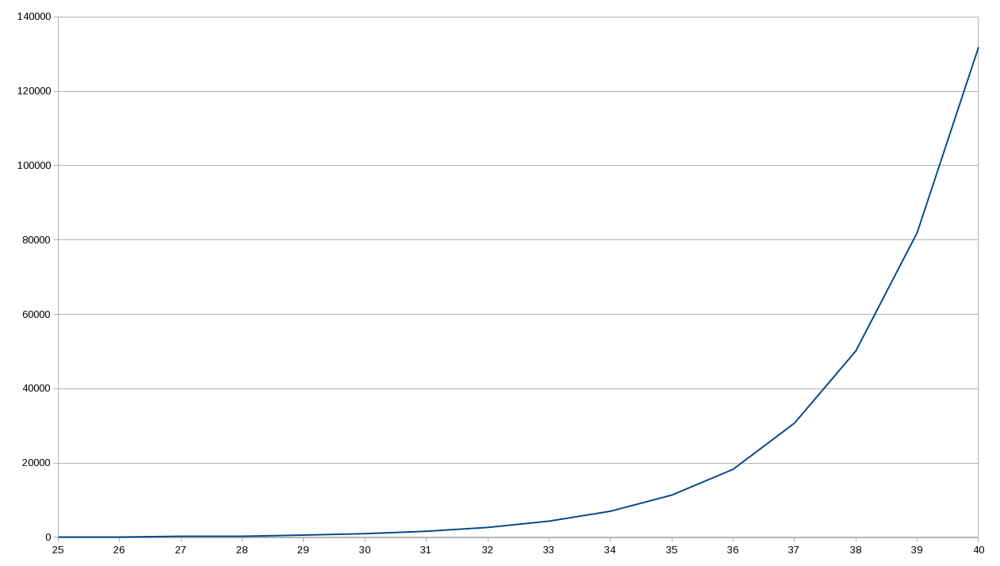
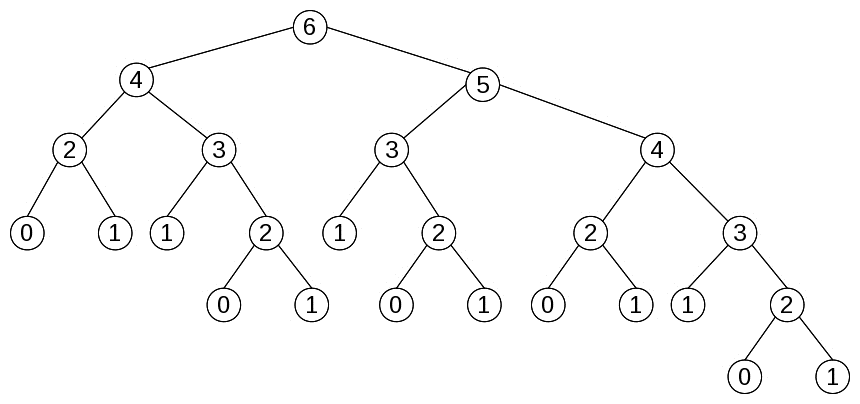

# Behaving Properly - Pure Functions

# 行为得体——纯函数


上一章我们重点介绍了函数式编程中的关键要素——函数，并详细介绍了箭头函数及相关概念，如注入（`injection`）、回调（`callback`）、填充（`polyfilling`）、打桩（`stubbing`）等。本章将重新审视并应用其中一些观点，并主要介绍以下内容：

- 引入“纯度”的概念，以及为何要关注纯函数、非纯函数；
- 考察“引用透明度”的概念；
- 认识到副作用隐含的问题；
- 介绍纯函数的一些优点；
- 阐述非纯函数背后的逻辑；
- 设法最小化非纯函数的数量；
- 探讨纯函数和非纯函数的测试方法。

---


## 4.1. 纯函数 Pure functions

纯函数的行为方式与数学上的函数相同，并具备诸多好处。当一个函数满足以下两个条件，即为 **纯函数**：

- **给定相同的参数，该函数总是计算并返回相同的结果**：无论调用多少次或在什么条件下调用，该命题都成立；其结果不依赖于任何 **外部** 的信息或状态，否则这些信息或状态可能会在程序执行期间发生变化并导致返回值的改变。函数结果也不能依赖于 `I/O` 结果、随机数、以及其他一些外部变量或不能直接控制的值；
- **在计算其结果时，该函数不会引起任何可观察到的“副作用”**：这包括输出到 `I/O` 终端、对象的改变、函数外的程序状态更改等等；

简单来说，纯函数不依赖（也不修改）其作用域之外的任何内容，并且始终为相同的输入参数返回相同的结果。

在该语境下常用的另一个术语概念是 **幂等性**，但二者并不完全相同。幂等函数可以根据需要多次调用，并且总是产生相同的结果；但这并不意味着该函数没有副作用。幂等性通常出现在 `RESTful` 风格的服务上下文中。这里举个简单的例子来区分纯度（`purity`）和幂等性（`idempotency`）。调用 `PUT` 请求会导致数据库记录被更新（副作用），但如果反复调用，元素将不会被进一步修改，因此数据库的全局状态也不会进一步改变。

借用一个软件设计原则（单一职责）来提醒自己：一个函数应该 **做一件事就只做这件事，除此之外什么都不做**。如果一个函数实现了其他逻辑或具备一些隐藏功能，那么该函数对其状态的依赖将无法正确预测结果，加大开发者的处理难度。

下面就来深入研究一下这些控制因素。


### 4.1.1. 引用透明 Referential transparency


数学里的 **引用透明** 是一种特性（`property`），可以用表达式的值替换表达式，而不改变原来的任何结果。

> **知识拓展**
>
> 引用透明的对立面，是 **引用不透明**。这样的函数在调用时，即便使用相同的参数也无法保证总是产生相同的结果。

例如，考虑一个做优化处理的编译器在执行 **常量折叠** 时发生的变化。原始代码如下：

```js
const x = 1 + 2 * 3;
```

编译器可能会将 `2 * 3` 视为常量，优化为：

```js
const x = 1 + 6;
```

更理想的情况，甚至可以完全避免求和：

```js
const x = 7;
```

编译器正是利用了所有数学表达式和函数按照定义都具备的引用透明的特性来节省执行时间的。此外，如果编译器无法预测给定表达式的结果，则无法完成任何形式的代码优化，只能在运行时进行计算。

> **拓展**
>
> 在 λ 演算中，如果将目标函数表达式的值替换为函数的计算值，则该操作称为 **β 化简**。请注意，这里只能使用引用透明的函数。

所有的算术表达式（包含数学运算符和函数）都是引用透明的：`22 * 9` 总是可以被 `198` 替换；涉及 `I/O` 的表达式是不透明的，因为在具体执行之前无法得知它们的结果。同理，涉及日期和时间相关的函数或随机数表达式也是不透明的。

至于自定义的函数，很容易写出一些不满足 **引用透明** 条件的来。事实上，一个函数甚至都不需要返回一个值，尽管 `JavaScript` 解释器会默认返回一个 `undefined` 的值。

> **拓展**
>
> 一些语言还区分了函数（`function`）和过程（`procedure`）。函数要返回一个值，过程不返回任何东西；但 `JavaScript` 不是。还有一些编程语言提供了确保函数引用透明的方法。

如果要分类的话，函数可以分为以下三类：

- **纯函数**：返回值至取决于函数参数、没有任何副作用的函数；
- **副作用函数**：不返回任何值、但会产生某些副作用的函数（实际上也会返回一个 `undefined` 值，但不是讨论重点）；
- **带副作用的函数**：返回值不仅仅取决于参数，还含有一些副作用。

在函数式编程中，尤为强调第一类——引用透明的纯函数。此时编译器不仅可以推断程序行为（从而能够优化生成的代码），程序员也可以更轻松地推断程序及其组件之间的联系。这反过来又可以帮助证明算法的正确性，或通过函数等效替换来进一步优化代码。


### 4.1.2. 副作用 Side effects

何为 **副作用**？我们可以将其定义为在执行某些计算或过程期间，程序所发生的状态变化；或者与外部元素所发生的交互，如用户、Web 服务、另一台计算机等等。

对于这个定义的适用范围可能存在误解。在日常谈话中一谈到副作用，更像是在谈论 **附带伤害**——某个特定行为的一些意料之外的结果；然而，计算机领域的副作用，则包含了函数外部的所有可能的影响或变化。如果一个函数要执行 `console.log()` 来显示结果，则会被视为副作用，即便它正是该函数本应实现的首要功能。

本节主要介绍以下内容：

- `JavaScript` 中常见的副作用；
- 全局及内部状态引发的问题；
- 函数参数不固定时的情况；
- 一些总是很棘手的函数；


#### 1 常见副作用 Usual side effects

编程中被视为副作用的东西可太多了。在 `JavaScript` 中，无论前端后端，您可能会看到以下常见的副作用：

- 改变全局变量；
- 改变作为参数传入的对象；
- 任何类型的输入输出操作，例如显示 `alert` 消息或将一些文本写入日志；
- 操作、更改文件系统；
- 更新数据库；
- 调用 `Web` 服务；
- 查询或修改 `DOM`；
- 触发任何外部进程；
- 仅仅是调用了另一个碰巧产生副作用的函数。这可以理解为不纯函数具有 **传染性**：调用不纯函数的函数会自动变为不纯函数！

有了这个定义，让我们来看看哪些因素会导致函数不纯（或引用不透明）。


#### 2 全局状态下的副作用 Global state

在上述所有要点中，产生副作用的最常见原因，是使用了与程序其他模块共享了全局状态的非局部变量。根据定义，纯函数总是在给定相同入参的情况下返回相同的出参值。如果一个函数引用了其内部状态之外的任何东西，则会自动变为不纯函数；这也为后续调试制造了障碍：要了解一个函数实现了什么功能，必须理解该状态如何获取到当前最新的值——这意味着必须理解在这之前的所有历史代码逻辑：这可不是个轻松活。

让我们编写一个函数，通过检查一个人是否至少出生于 18 年前，来判定他们是否是合法成年人。（诚然这不够精确，因为没有考虑出生日期和月份；但请多担待，这不是讨论的重点）。满足需求的函数 `isOldEnough()` 代码实现如下：

```js
let limitYear = 1999;

const isOldEnough = birthYear => birthYear <= limitYear;

console.log(isOldEnough(1960)); // true
console.log(isOldEnough(2001)); // false
```

函数 `isOldEnough()` 可以正确检测某人是否至少 18 岁，但这取决于一个外部变量（该变量仅适用于 2017 年）。除非您了解外部变量的含义、并知晓它是如何获取到值的，否则将无从了解该函数的作用。而且测试也会很困难：必须记得创建全局变量 `limitYear`，否则测试将无法进行。即使该函数有效，但代码实现并不是最佳的。

这种情况也有例外：考察以下函数 `circleArea()`，用于计算给定半径的圆面积。该函数是否为纯函数呢？

```js
const PI = 3.14159265358979;
const circleArea = r => PI * Math.pow(r, 2); // 或 PI * r ** 2
```

即便函数访问了外部状态，但 `PI` 是一个常量（因此无法修改）的事实，允许我们在没有功能性修改的前提下，在 `circleArea` 内部将其替换为一个值，因此可被视为一个纯函数。该函数将始终为相同的参数返回相同的值，从而符合纯度定义。

> **提示**
>
> 即使换用 `Math.PI` 而非代码中定义的常量（顺便说一下，用 `Math.PI` 是更好的解决方案），参数仍然是相同的；常量不会改变，所以仍然是纯函数。

了解了全局状态引起的副作用，再来看看函数内部状态的问题。


#### 3 内部状态下的副作用 Inner state

副作用的概念还可以推广到保存了本地状态、以备后续调用的内部变量。此时外部状态没有变化，但由于函数的返回值所隐含的后续状态差异，仍有可能引入副作用。不妨假设一个舍入函数 `roundFix()` ，为了让上下舍入的累计误差趋近于零，函数会在下一次运算时执行与本次相反的舍入操作。该函数将不得不对先前舍入的总效应做一个汇总来决定下一步操作，可能的代码实现如下：

```js
const roundFix = (function() {
    let accum = 0;
    return n => {
        // 实际上下或向下舍入取决于 accum 的符号
        let nRounded = accum > 0 ? Math.ceil(n) : Math.floor(n);
        console.log("accum", accum.toFixed(5), " result", nRounded);
        accum += n - nRounded;
        return nRounded;
    };
})();
```

其中——

- 本例中的 `console.log()` 只是便于罗列当前的累计误差及函数的返回值，看看是执行了向上还是向下舍入，实际不会包含在函数中；
- 为了获取一个隐藏的内部变量，这里用到了 `IIFE` 模式；
- 第 5 行求 `nRounded` 的值也可以写作 `Math[accum > 0 ? "ceil": "floor"](n)`——考察 `accum` 的正负来决定调用 `ceil` 或 `floor`，然后用 `Object["method"]` 的写法调用 `Object.method()`。本例的写法其实更清楚，这里只是给出另一种写法，仅供参考。

只用两个值测试该函数（发现了吗）结果表明：对于给定的输入，最终结果并不总是相同。控制台打印部分展示了某个值是如何上下舍入的：

```js
roundFix(3.14159); // accum  0.00000    result 3
roundFix(2.71828); // accum  0.14159    result 3
roundFix(2.71828); // accum -0.14013    result 2
roundFix(3.14159); // accum  0.57815    result 4
roundFix(2.71828); // accum -0.28026    result 2
roundFix(2.71828); // accum  0.43802    result 3
roundFix(2.71828); // accum  0.15630    result 3
```

第一轮，`accum` 为零，`3.14159` 向下舍入，`accum` 变为 `0.14159`，符合预期；
第二轮，`accum` 为正，向上收入，故 `2.71828` 被收至 `3`，`accum` 变为负数；
第三轮，`accum` 为负，相同的值 `2.71828` 被舍入为 `2`——相同的输入，却得到了不同的值。

可见，由于函数的结果取决于其 **内部状态**，同样的参数在累计误差的作用下，可以向上或向下舍入而得到不同的结果。

> **提示**
>
> 像这样使用内部状态，也是许多 `FP` 开发者认为使用对象可能不太好的原因。在面向对象编程中，开发者习惯于存储信息到某个属性，以备后续调用；然而，这种做法被认为是不纯的（`impure`），因为重复的方法调用也可能返回不同的值，尽管传入了相同的参数。

除了全局及内部状态下的副作用，还有其他情况也可能存在副作用，比如改变传入的参数值的情况。一起来看看吧。


#### 4 改变参数导致的副作用 Argument mutation

不纯函数会修改参数值——这一情况也要引起重视。在 `JavaScript` 中，参数是按 **值** 传递的，但数组和对象除外，它们是按 **引用** 传递的。这意味着对函数形参的任何修改都会引起实参中原对象或数组的实际修改。`JavaScript` 中的几个突变方法（mutator methods）可以根据定义修改目标对象，进一步掩盖了这一副作用。例如，想要一个可以找出字符串数组中最大元素的函数（若为数字数组，可以简单地使用 `Math.max()`），假设代码实现如下：

```js
const maxStrings = a => a.sort().pop();

let countries = ["Argentina", "Uruguay", "Brasil", "Paraguay"];
console.log(maxStrings(countries)); // "Uruguay"
```

该函数确实能得出正确结果（若考虑外语对排序的影响，请参考上一章的相关章节)，但它存在一个缺陷。考察原始数组：

```js
console.log(countries); // ["Argentina", "Brasil", "Paraguay"]
```

糟糕——原数组被修改了；这就是副作用。如果您要再次调用 `maxStrings(countries)`，那么它不会返回与之前相同的结果，而是得到另一个值；该函数显然不是纯函数。面对这种情况，一个快速解决方案是使用数组的副本（如借助扩展运算符，更多处理手法将在第十章重点论述）：

```js
const maxStrings2 = a => [...a].sort().pop();

let countries = ["Argentina", "Uruguay", "Brasil", "Paraguay"];
console.log(maxStrings2(countries)); // "Uruguay"
console.log(countries); // ["Argentina", "Uruguay", "Brasil", "Paraguay"]
```

至此，我们讨论了修改函数自身参数引起的副作用，再来考察最后一种情况：函数被迫为不纯函数。


#### 5 一些棘手的函数 Troublesome functions

最后，一些函数本身也会带来问题。例如，随机函数 `Math.random()` 本身就是不纯的：它并不总是返回相同的值，否则就与设计初衷相违背。该函数每调用一次，就会修改一个全局 `seed` 值，以便计算下一个随机数。

> **拓展**
>
> 随机数实际上是由内部函数计算得到的，因此根本不是随机的（如果提前知道使用的公式和种子的初值的话），更名为 `pseudorandom` 可能更准确。

例如，考虑如下函数，用于生成随机字母（`A` 到 `Z`）：

```js
const getRandomLetter = () => {
    const min = "A".charCodeAt();
    const max = "Z".charCodeAt();
    return String.fromCharCode(
        Math.floor(Math.random() * (1 + max - min)) + min
    );
};
```

该函数不接收任何参数，但却能在每次调用时会产生不同的结果，这一事实清楚地表明，该函数是不纯的。

> **提示**
>
> 关于 `getRandomLetter()` 函数的详细解释，参考 [MDN 文档之 random](https://developer.mozilla.org/en-US/docs/Web/JavaScript/Reference/Global_Objects/Math/random)；更多 `.charCodeAt()` 介绍，详见 [MDN 文档之 String](https://developer.mozilla.org/en-US/docs/Web/JavaScript/Reference/Global_Objects/String)。

非纯特性可以通过调用函数来传播。如果一个函数用到了一个不纯的函数，它自身就会立即变得不纯。例如，想用函数 `getRandomLetter()` 来生成随机文件名，并带有可选的给定扩展名。假设代码实现如下：

```js
const getRandomFileName = (fileExtension = "") => {
    const NAME_LENGTH = 12;
    let namePart = new Array(NAME_LENGTH);
    for (let i = 0; i < NAME_LENGTH; i++) {
        namePart[i] = getRandomLetter();
    }
    return namePart.join("") + fileExtension;
};
```

> **提示**
>
> 第五章《声明式编程——一种更好的风格》中，还会利用 `map()` 函数的特性，介绍一种更偏函数式风格的方法来初始化数组 `namePart`。

由于用到了非纯函数 `getRandomLetter()`，原函数 `getRandomFileName()` 也变得不纯了，尽管函数运行符合预期，能正确生成完全随机的文件名： 

```js
console.log(getRandomFileName(".pdf"));  // "SVHSSKHXPQKG.pdf"
console.log(getRandomFileName(".pdf"));  // "DCHKTMNWFHYZ.pdf"
console.log(getRandomFileName(".pdf"));  // "GBTEFTVVHADO.pdf"
console.log(getRandomFileName(".pdf"));  // "ATCBVUOSXLXW.pdf"
console.log(getRandomFileName(".pdf"));  // "OIFADZKKNVAH.pdf"
```

记住这个函数，后续章节我们还将围绕它谈谈单元测试的问题，并在此基础上做一些改动来解决这个问题。

The concern about impurity also extends to functions that access the current time or date, because their results will depend on an outside condition (namely the time of day) that is part of the *global state* of the application. We could rewrite our isOldEnough() function to remove the dependency upon a global variable, but it wouldn't help much. An attempt could be as follows:

对杂质的关注也延伸到访问当前时间或日期的函数，因为它们的结果将取决于作为应用程序*全局状态*一部分的外部条件（即一天中的时间）。 我们可以重写我们的 isOldEnough() 函数来消除对全局变量的依赖，但这并没有多大帮助。 尝试如下

非纯特性也可以推广至当前时间或日期的访问，因为它们的结果取决于外部条件（即一天里的时间）——也是应用程序全局状态的一部分。我们也可以重写函数 `isOldEnough()` 来消除原函数对全局变量的依赖，但这并没有多大帮助。尝试改动代码如下：

```js
const isOldEnough2 = birthYear =>
  birthYear <= new Date().getFullYear() - 18;

console.log(isOldEnough2(1960)); // true
console.log(isOldEnough2(2001)); // false
```

此时解决了一个问题——新的 `isOldEnough2()` 函数现在更安全了。此外，只要不在元旦午夜前后使用它，函数就会始终返回相同的结果，因此，套用 19 世纪的 `Ivory Soap` 的口号，可以说该函数 **大约 99.44% 是纯的**；但是仍有不便：如何测试？万一编写的函数今天运行良好，明年偏就就会测试失败呢？所以还需要做一些工作来解决这个问题，后续会详讲。

还有其他几个同样不纯的函数，例如那些导致 `I/O` 的函数。如果函数从某个数据源（`Web` 服务、用户自己、文件或其他源）获取输入，显然返回的结果会有所不同。同时还应该考虑 `I/O` 搞错的可能，因此调用相同服务或读取相同文件的相同函数可能在某些时候由于不可抗力的因素而调用失败（也可以假设文件系统、数据库、套接字这些可能统统都不可用，此时调用指定的函数可能会产生某个错误，而不是意料中的常量、或不变的结果）。

即使是单纯输出结果、或通常不会在内部（至少以可见方式）更改任何内容的一般安全语句（如 `console.log()`），也会导致一些副作用。因为用户确实看到了更改：根据生成的输出结果。

凡此种种，是否意味着永远无法编写出一个程序，既能得到随机数、又能处理日期、还能允许 `I/O` 操作、并且还能同时使用纯函数呢？答案是否定的——但这确实意味着一些函数是不纯的，使用时必须考虑它们存在的不足；稍后会继续讨论。


### 4.1.3. 纯函数的好处 Advantages of pure functions

纯函数的主要优点在于其没有副作用。调用纯函数时，除了对其传参外，无需担心任何事情。更重要的是，由于纯函数只对您提供的内容起作用，而与其他外部资源无关，从而可以确保函数不会产生任何问题或破坏任何原有逻辑。这还不是纯函数的唯一优势，本节将介绍纯函数的更多知识。

#### 1 执行顺序 Order of execution

另一种看待本章所述内容的方式，是将纯函数视为 **健壮性** 的体现。无论纯函数以何种顺序执行，都不会对系统产生任何不良影响。这一点可以进一步扩展：并行执行纯函数也是可以的，不必担心并行运算下的结果与在单线程中得到的结果有所不同。

> **拓展**
>
> 只可惜 `JavaScript` 极力限制开发者编写并行代码，仅能在极其有限的情况下通过 web workers 实现并行逻辑，仅此而已。对于 `Node` 开发者，`cluster` 集群模块可能会有所助益，尽管它并不是线程的替代品，只不过可以生成多个进程、利用所有线程的 `CPU` 内核罢了。总之，`JavaScript` 并未提供诸如 `Java` 线程之类的功能特性，并行化并不能算作 `JavaScript` 函数式编程的主要优势。

另一个要记住的点是，纯函数是无需明确指定调用顺序的。就像数学上的表达式 `f(2) + f(5)` 总是等效于 `f(5) + f(2)` ，这被称为**可交换属性（commutative property）**。

但是对非纯函数，结论可能就是错的，例如：

```js
var mult = 1;
const f = x => {
    mult = -mult;
    return x * mult;
};

console.log(f(2) + f(5)); //  3
console.log(f(5) + f(2)); // -3
```

> **小贴士**
>
> 对于上述非纯函数，不能假设 `f(3) + f(3)` 的结果与 `2 * f(3)` 相同，或者假设 `f(4) - f(4)` 的值为 `0`，不信试试看。本例中其他通用的数学性质也不成立。

为什么要关心这个问题？无论是否愿意，编写代码时或多或少都会记住诸如数学 **交换律** 这样的性质。如此一来，当您想当然地以为两个表达式会得到相同的结果、实现相应的逻辑时，一遇到这些由于非纯函数而引入的难搞的 `Bug` 就会惊讶不已。

#### 2 函数记忆 Memoization

鉴于给定输入的纯函数得到的结果始终相同，利用这一特性，可以缓存函数的返回结果来避免性能开销可能相当高昂的重复运算。像这样，对某表达式求值只需运行一次，后续调用则返回该缓存结果的过程，称为 **函数记忆**（`memoization`）。

第六章《生成函数——高阶函数详解》中还会继续深入讨论，这里先手动实现一例。裴波拉契序列由于其简洁性和背后隐藏的运算开销问题，常被用作相关演示。该序列定义如下：

- 当 *n* = 0，*fib*(*n*) = 0；
- 当 *n* = 1，*fib*(*n*) = 1；
- 当 *n* > 1，*fib*(*n*) = *fib*(*n*-2) + *fib*(*n*-1)。

> **知识拓展**
>
> 斐波那契的名字实际上来自 ***filius Bonacci***，或 ***Bonacci*** 之子。他最出名的是引入了我们今天所熟知的数字 0-9 的用法，而不是繁琐的罗马数字。他从一个有关兔子的谜题中，推导出了以他名字命名的序列作为问题的答案。更多斐波那契的生平介绍，详见 [Wiki](https://en.wikipedia.org/wiki/Fibonacci_number#History or https://plus.maths.org/content/life-and-numbers-fibonacci)。

该序列从 0、1 开始，之后每一项都是前两项的和：即 1，接着是 2、3、5、8、13、21，依此类推。利用递归编程实现该系列很简单；第九章《设计函数——递归思想》还将重新讨论这个示例。该序列的直译版代码实现如下：

```js
const fib = (n) => {
    if (n == 0) {
        return 0;
    } else if (n == 1) {
        return 1;
    } else {
        return fib(n - 2) + fib(n - 1);
    }
}
//
console.log(fib(10)); // 55, 略慢
```

> **提示**
>
> 如果只用一行代码实现该序列，也可以写作 `const fib = (n) => (n<=1) ? n : fib(n-2) + fib(n-1)`——看明白了吗？重要的是，牺牲代码的清晰逻辑换来的极简代码实现，是否值得？

如果增大该函数中 n 的值，则很快会暴露问题，函数求值变得越来越耗时。以毫秒为单位在笔者电脑上实测，最终得到如下所示的时间分布图（具体取值因设备而异）。

如果您尝试使用此函数来增加 n 的值，您很快就会意识到存在问题，并且计算开始花费太多时间。 例如，在我的机器上，我进行了一些计时，以毫秒为单位，并将它们绘制在下图中（当然，您的里程可能会有所不同）。 由于该函数运算速度很快，笔者只好对介于 0 和 40 之间的 `n` 值运行 100 次后再作图。即便如此，当 n 值较小时，耗时也非常短。只有从 n = 25 开始，才得到有代表性的数据。图 4.1 显示了指数级增长情况，预示情况不乐观：



<p align="center" style="font-weight: bolder;">图 4.1：递归函数 fib() 的运算时间呈指数级增长</p>

如果绘制出计算 `fib(6)` 所需的所有函数调用情况，就会注意到问题所在。每个节点代表一次 `fib(n)` 调用：观察节点中 `n` 的值。每次调用，除了 *n = 0* 或 *1*，其他调用都需要进一步运算，如图 4.2 所示：



<p align="center" style="font-weight: bolder;">图 4.2：fib(6) 的所有运算显示存在大量重复运算</p>

延迟增加的原因很明显：`fib(2)` 的计算在四个不同的地方重复；而 `fib(3)` 本身也计算了 3 次。鉴于 `fib` 函数是纯函数，我们可以缓存计算出的结果以避免反复运算某个节点值。利用缓存数组，一个可能的代码实现版本如下：

```js
let cache = [];
const fib2 = (n) => {
    if (cache[n] === undefined) {
        if (n === 0) {
            cache[0] = 0;
        } else if (n === 1) {
            cache[1] = 1;
        } else {
            cache[n] = fib2(n - 2) + fib2(n - 1);
        }
    }
    return cache[n];
}
console.log(fib2(10)); // 55，同上，但更快了
```

最初，缓存数组为空数组。每当计算 `fib2(n)` 的值时，都会检查它是否已经预先计算过。若没算过，则执行计算，但有一个处理：先将结果存入缓存后，再返回函数值。这意味着不存在重复运算：一旦计算了 `fib2(n)` 后，后续调用将不会重复该过程，而只返回之前缓存的值即可。

此外还要注意以下几点：

- 手动实现的记忆函数也可以通过高阶函数来实现。第六章会详细介绍，实现在无需变更或重写原函数的情况下，记住原函数值的效果；
- 用全局变量替代缓存数组不是一个很好的做法；隐藏缓存可以使用 `IIFE` 和闭包——详见第三章 `myCounter()` 函数示例相关内容；
- 可用缓存空间的限制也要纳入考虑。应用程序可能最终会耗尽所有可用 `RAM` 而崩溃。借助外部存储设备（如数据库、文件系统或云解决方案）又可能会抵消掉缓存带来的所有性能优势。有一些标准的解决方案（如最终从缓存中删除数据），但这些知识超出了本书讲述的范围；

当然，程序中的每个纯函数并非都要都执行该操作。本例关注的是需要花费一定时间、且频繁调用的函数——若非如此，增加的缓存管理时间很可能会超过其节省下的时间开销。


#### 3 自带文档描述 Self-documentation

纯函数还有另一个优点。由于函数需要处理的所有内容都是通过参数提供的，没有任何隐藏的依赖关系，因此阅读源码也就理解了函数想实现的功能。

一个额外的好处：明确一个函数不会访问它的参数之外的任何东西后，使用时就更有信心，不必担心意外的副作用；该函数唯一能完成的逻辑就是文档要求的东西。

单元测试（下一节介绍）也能充当文档，因为它们提供了在给定某些参数时函数返回结果的示例。大多数程序员都相信最好的文档是充满了大量示例的文档，并且每个单元测试都可视为文档示例。

#### 4 利于测试

纯函数的另一个优势——也是最重要的优势之一——在于单元测试。纯函数只有一个职责：根据输入得到输出。因此，对纯函数编写测试用例时，由于无需考虑上下文，也无需模拟任何状态，工作量将大大简化。

纯函数只需要关注输入、检查输出即可。所有函数调用都是相互独立的。

至此，我们已经考察了纯函数的几个主要方面。接下来目光转到非纯函数，最后再看看二者的测试工作如何进行。


## 4.2. 非纯函数 Impure functions

If you decided to completely forego all kinds of side effects, then your programs would only be able to work with hardcoded inputs, and wouldn't be able to show you the calculated results! Similarly, most web pages would be useless: you wouldn't be able to make any web services calls or update the DOM; you'd have static pages only. And your Node code would be really useless for server-side work, as it wouldn't be able to perform any I/O.

Reducing side effects is a good goal in FP, but we shouldn't go overboard with it! So let's think of how to avoid using impure functions, if possible, and how to deal with them if not, looking for the best possible way to contain or limit their scope.


### 4.2.1. 避开非纯函数 Avoiding impure functions

Earlier in this chapter, we saw the more common reasons for using impure functions. Let's now consider how we can reduce the number of impure functions, even if doing away with all of them isn't really feasible. Basically, we'll have two methods for this:

- Avoiding the usage of state
- Using a common pattern, *injection*, to have impurity in a controlled fashion


#### 1 避免使用状态 Avoiding the usage of state

With regard to the usage of the global state—both getting and setting it—the solution is well known. The key points to this are as follows:

- Provide whatever is needed of the global state to the function as arguments.
- If the function needs to update the state, it shouldn't do it directly, but rather produce a new version of the state and return it.
- It should be the responsibility of the caller to take the returned state, if any, and update the global state.

This is the technique that Redux uses for its reducers. The signature for a reducer is (previousState, action) => newState, meaning that it takes a state and an action as parameters and returns a new state as the result. Most specifically, the reducer is not supposed to simply change the previousState argument, which must remain untouched (we'll learn more about this in [Chapter 10](https://subscription.packtpub.com/book/web_development/9781839213069/1), *Ensuring Purity – Immutability*).

With regard to our first version of the isOldEnough() function, which used a global limitYear variable, the change is simple enough: we just have to provide limitYear as a parameter for the function. With this change, it will become pure, since it will produce its result by only using its parameters. Even better, we should provide the current year and let the function do the math instead of forcing the caller to do so. Our newer version of the adult age test could then be as follows:

```js
const isOldEnough3 = (currentYear, birthYear) => birthYear <= currentYear-18;
```

Obviously, we'll have to change all the calls to provide the required limitYear argument (we could also use currying, as we will see in [Chapter 7](https://subscription.packtpub.com/book/web_development/9781839213069/5/ch05lvl1sec21/impure-functions), *Transforming Functions – Currying and Partial Application*). The responsibility of initializing the value of limitYear still remains outside of the function, as before, but we have managed to avoid a defect.

We can also apply this solution to our peculiar roundFix() function. As you will recall, the function worked by accumulating the differences caused by rounding, and deciding whether to round up or down depending on the sign of that accumulator. We cannot avoid using that state, but we can split off the rounding part from the accumulating part. Our original code (with fewer comments and logging) looked as follows:

```js
const roundFix1 = (function() {
  let accum = 0;
  return n => {
    let nRounded = accum > 0 ? Math.ceil(n) : Math.floor(n);
    accum += n - nRounded;
    return nRounded;
  };
})();
```

The newer version would have two parameters:

```js
const roundFix2 = (a, n) => {
  let r = a > 0 ? Math.ceil(n) : Math.floor(n);
  a += n - r;
  return {a, r};
};
```

How would you use this function? Initializing the accumulator, passing it to the function, and updating it afterward are now the responsibility of the caller code. You would have something like the following:

```js
let accum = 0;

// ...some other code...

let {a, r} = roundFix2(accum, 3.1415);
accum = a;
console.log(accum, r); // 0.1415 3
```

Note the following:

- The accum phrase is now part of the global state of the application.
- Since roundFix2() needs it, the current accumulator value is provided in each call.
- The caller is responsible for updating the global state, not roundFix2().

> ProTip
>
> Note the usage of the destructuring assignment in order to allow a function to return more than a value and easily store each one in a different variable. For more on this, go to https://developer.mozilla.org/en/docs/Web/JavaScript/Reference/Operators/Destructuring_assignment.

This new roundFix2() function is totally pure and can be easily tested. If you want to hide the accumulator from the rest of the application, you could still use a closure, as we have seen in other examples, but that would again introduce impurity in your code—your call!


#### 2 注入非纯函数 Injecting impure functions

If a function becomes impure because it needs to call another function that is itself impure, a way around this problem is to inject the required function in the call. This technique actually provides more flexibility in your code and allows for easier future changes, as well as less complex unit testing.

Let's consider the random filename generator function that we saw earlier. The problematic part of this function is its usage of getRandomLetter() to produce the filename:

```js
const getRandomFileName = (fileExtension = "") => {
  ...
  for (let i = 0; i < NAME_LENGTH; i++) {
    namePart[i] = getRandomLetter();
  }
  ...
};
```

A way to solve this is to replace the impure function with an injected external one; we must now provide a randomLetterFunc() argument for our random filename function to use:

```js
const getRandomFileName2 = (fileExtension = "", randomLetterFunc) => {
  const NAME_LENGTH = 12;
  let namePart = new Array(NAME_LENGTH);
  for (let i = 0; i < NAME_LENGTH; i++) {
    namePart[i] = randomLetterFunc();
  }
  return namePart.join("") + fileExtension;
};
```

Now, we have removed the inherent impurity from this function. If we want to provide a predefined pseudorandom function that actually returns fixed, known, values, we will be able to easily unit test this function; we'll be seeing how to do this in the following examples. The usage of the function will change, and we would have to write the following:

```js
let fn = getRandomFileName2(".pdf", getRandomLetter);
```

If this bothers you, you may want to provide a default value for the randomLetterFunc parameter, as follows:

```js
const getRandomFileName2 = (
  fileExtension = "",
  randomLetterFunc = getRandomLetter
) => {
  ...
};
```

You can also solve this using partial application, as we'll be seeing in [Chapter 7](https://subscription.packtpub.com/book/web_development/9781839213069/5/ch05lvl1sec21/impure-functions), *Transforming Functions – Currying and Partial Application*. 

This hasn't actually avoided the usage of impure functions. Normally, you'll call getRandomFileName() by providing it with the random letter generator we wrote, so it will behave as an impure function; however, for testing purposes, if you provide a function that returns predefined (that is, not random) letters, you'll be able to test it as if it was pure much more easily.

But what about the original problem function, getRandomLetter()? We can apply the same trick and write a new version, like the following, which will have an argument that will produce random numbers:

```js
const getRandomLetter = (getRandomInt = Math.random) => {
  const min = "A".charCodeAt();
  const max = "Z".charCodeAt();
  return String.fromCharCode(
    Math.floor(getRandomInt() * (1 + max - min)) + min
  );
};
```

For normal usage, getRandomFileName() would call getRandomLetter() without providing any parameters, which would imply that the called function would behave in its expected random ways. But if we want to test whether the function does what we wanted, we can run it with an injected function that will return whatever we decide, letting us test it thoroughly.

This idea is actually very important and has a wide spectrum of applications to other problems. For example, instead of having a function directly access the DOM, we can provide it with injected functions that would do this. For testing purposes, it would be simple to verify that the tested function actually does what it needs to do without really interacting with the DOM (of course, we'd have to find some other way to test those DOM-related functions). This can also apply to functions that need to update the DOM, generate new elements, and do all sorts of manipulations—you just use some intermediary functions. 


### 4.2.2. 纯函数判定 Is your function pure?

Let's end this section by considering an important question: can you ensure that a function is actually pure? To show the difficulties of this task, we'll go back to the simple sum3() function that we saw in the *Spread* section of [Chapter 1](https://subscription.packtpub.com/book/web_development/9781839213069/5/ch05lvl1sec21/902ca71c-dbdf-4e81-8498-11d0946f2658.xhtml), *Becoming Functional – Several Questions*, just rewritten to use arrow functions for brevity. Would you say that this function is pure? It certainly looks like it!

```js
const sum3 = (x, y, z) => x + y + z;
```

Let's see: the function doesn't access anything but its parameters, doesn't even try to modify them (not that it could (or could it?)), doesn't perform any I/O, or work with any of the impure functions or methods that we mentioned earlier. What could go wrong? 

The answer has to do with checking your assumptions. For example, who says the arguments for this function should be numbers? You might say to yourself *Okay, they could be strings, but the function would still be pure, wouldn't it?*, but for an (assuredly evil!) answer to that, see the following code:

```js
let x = {};
x.valueOf = Math.random;

let y = 1;
let z = 2;

console.log(sum3(x, y, z)); // 3.2034400919849431
console.log(sum3(x, y, z)); // 3.8537045249277906
console.log(sum3(x, y, z)); // 3.0833258308458734
```

> ProTip
>
> Note the way that we assigned a new function to the x.valueOf method. We are taking full advantage of the fact that functions are first-class objects. See the *An unnecessary mistake* section in [Chapter 3](https://subscription.packtpub.com/book/web_development/9781839213069/5/ch05lvl1sec21/impure-functions), *Starting Out with Functions – A Core Concept*, for more on this.

Well, sum3() ought to be pure, but it actually depends on whatever parameters you pass to it; in JavaScript, you can make a pure function behave in an impure way! You might console yourself by thinking that surely no one would pass such arguments, but edge cases are usually where bugs reside. But you need not resign yourself to abandoning the idea of pure functions. By adding some type checking (TypeScript might come in handy, as mentioned in the *Using transpilers* section of [Chapter 1](https://subscription.packtpub.com/book/web_development/9781839213069/5/ch05lvl1sec21/902ca71c-dbdf-4e81-8498-11d0946f2658.xhtml), *Becoming Functional – Several Questions*), you could at least prevent some cases, though JavaScript won't ever let you be totally sure that your code is *always* pure!

Over the course of these sections, we have gone through the characteristics of both pure and impure functions. Let's finish the chapter by looking at how we can test all these sorts of functions.


## 4.3. 测试纯函数及非纯函数 Testing – pure versus impure

### 4.3.1. 纯函数测试 Testing pure functions

### 4.3.2. 纯化处理后的函数测试 Testing purified functions

### 4.3.3. 非纯函数测试 Testing impure functions

## 4.4. 小结 Summary

## 4.5. 思考题 Questions