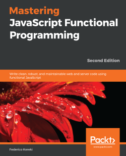

# 《Mastering JavaScript Functional Programming - Second Edition》学习笔记

书名：**Mastering JavaScript Functional Programming - Second Edition**

作者：***Federico Kereki***

出版：**Packt**，2020.01

简介：（待补）

笔记整理情况：

| No.  |               Chapter Title               |  Status  |
| :--: | :---------------------------------------: | :------: |
| Ch01 |     [Becoming Functional](./Ch01.md)      | **done** |
| Ch02 |    [Thinking Functionally](./Ch02.md)     | working  |
| Ch03 | [Starting Out with Functions](./Ch03.md)  |   read   |
| Ch04 |      [Behaving Properly](./Ch04.md)       |   read   |
| Ch05 |  [Programming Declaratively](./Ch05.md)   |   read   |
| Ch06 |     [Producing Functions](./Ch06.md)      |   read   |
| Ch07 |    [Transforming Functions](./Ch07.md)    |   read   |
| Ch08 |     [Connecting Functions](./Ch08.md)     |   read   |
| Ch09 |     [Designing Functions](./Ch09.md)      |   read   |
| Ch10 |       [Ensuring Purity](./Ch10.md)        |   read   |
| Ch11 | [Implementing Design Patterns](./Ch11.md) |   read   |
| Ch12 |  [Building Better Containers](./Ch12.md)  |   read   |

